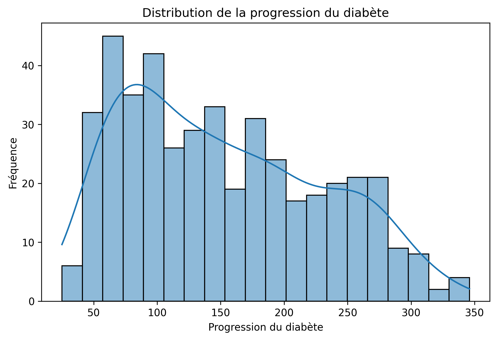
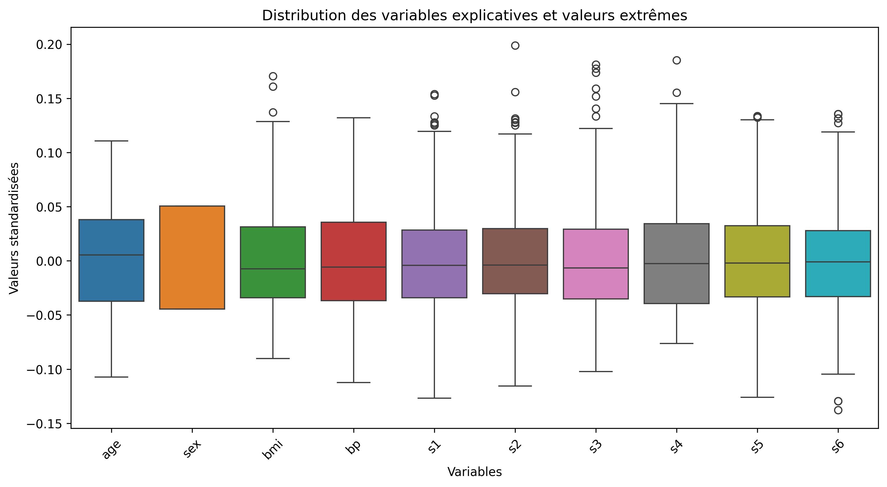
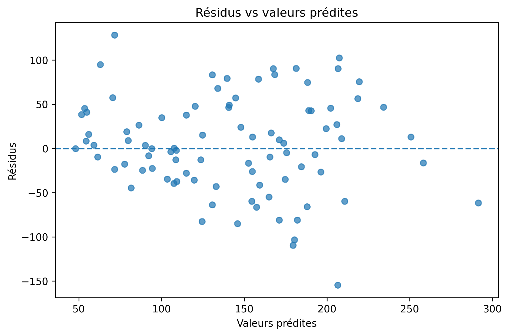
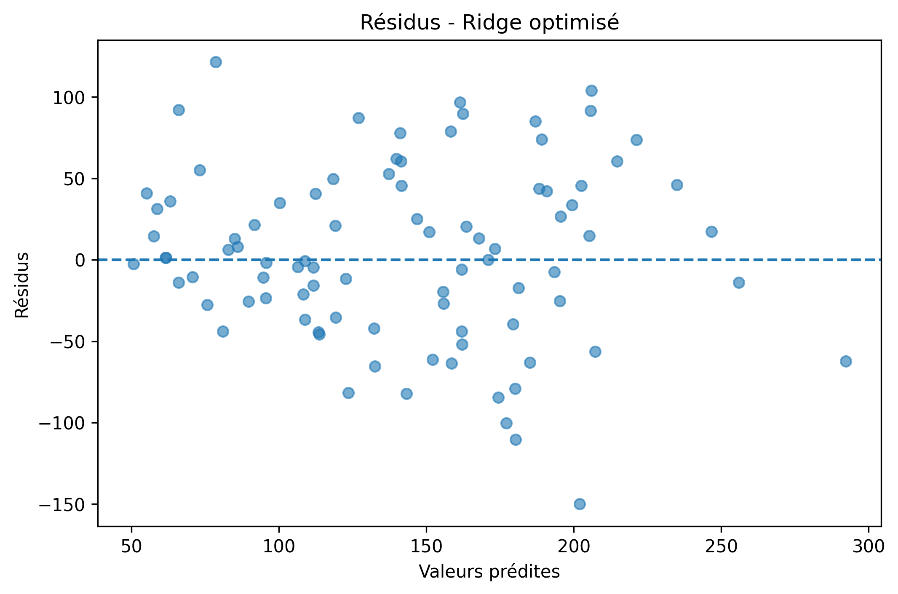
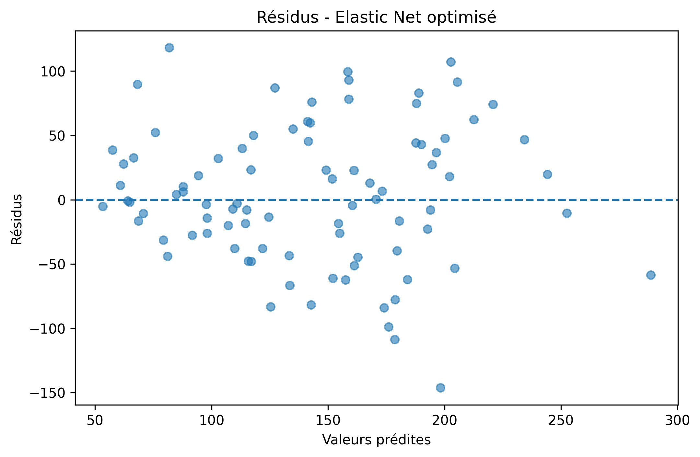
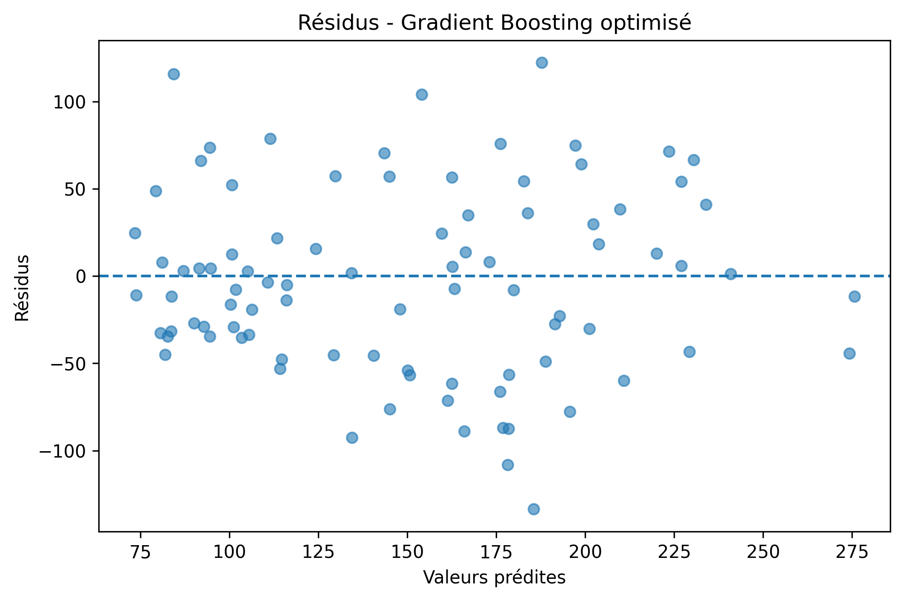
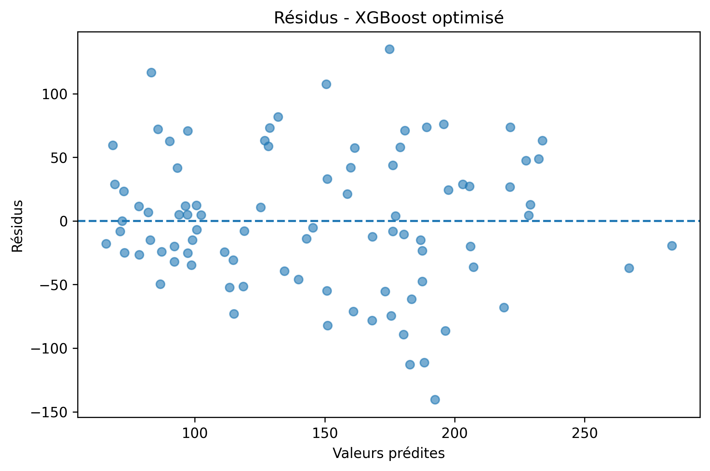
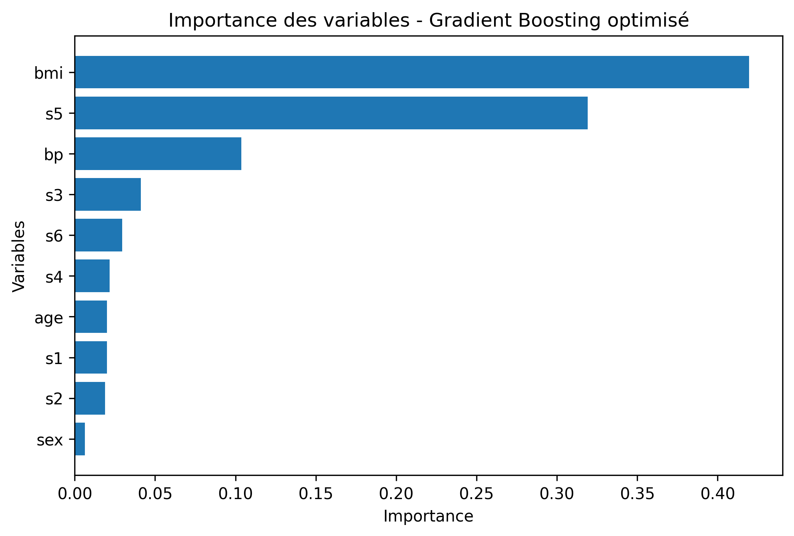

# 🩺 Prédiction de la progression du diabète avec le Machine Learning

## 📌 Présentation du projet

Ce projet consiste à développer un modèle de **régression supervisée** capable de prédire la progression de la maladie du diabète à partir de variables cliniques.

L'étude utilise le **Diabetes dataset de Scikit-learn** et suit une démarche complète de Machine Learning :

**EDA → Préparation des données → Modélisation → Optimisation → Évaluation → Diagnostic → Comparaison → Interprétation → Conclusion**

L'objectif est non seulement d'obtenir de bonnes performances prédictives, mais également de comprendre le comportement du modèle final et l'influence des variables sur ses prédictions.

---

## 🎯 Objectifs

Les principaux objectifs de cette étude sont :

- Explorer et comprendre les données.
- Identifier les relations entre les variables explicatives et la cible.
- Préparer les données pour la modélisation.
- Tester plusieurs algorithmes de régression.
- Optimiser leurs hyperparamètres avec `GridSearchCV`.
- Comparer objectivement leurs performances.
- Analyser les résidus.
- Identifier les variables les plus importantes.
- Interpréter le modèle final avec SHAP.
- Sélectionner le modèle offrant le meilleur compromis entre performance et généralisation.

---

# 1. 📊 Exploration des données

## 1.1 EDA univariée

L'analyse univariée permet d'étudier individuellement la distribution des variables et d'identifier d'éventuelles valeurs extrêmes.

### Distribution de la variable cible

La variable cible représente la progression de la maladie.



### Boxplots des variables explicatives

Les boxplots permettent d'identifier la dispersion des variables ainsi que la présence de valeurs extrêmes.



### Distribution des variables explicatives

Cette visualisation permet d'observer la forme des distributions des dix variables explicatives.


---

# 2. 🔎 EDA bivariée

L'analyse bivariée permet d'étudier les relations entre les variables explicatives et la progression du diabète.

## Matrice de corrélation de Pearson

La matrice permet d'identifier les principales associations linéaires entre les variables.


## Relations entre les principales variables

Un pairplot est utilisé pour visualiser simultanément les relations entre les variables les plus importantes et la cible.


---

# 3. ⚙️ Préparation des données

Les données ont été séparées en :

- **80 % pour l'entraînement**
- **20 % pour le test**

La séparation a été réalisée avec un `random_state=42` afin de garantir la reproductibilité des résultats.

Pour les modèles nécessitant une mise à l'échelle, notamment les modèles linéaires régularisés, une standardisation avec `StandardScaler` a été utilisée.

La validation croisée à **5 plis** a ensuite été utilisée lors de l'optimisation des hyperparamètres.

---

# 4. 🤖 Modélisation

Plusieurs algorithmes de régression ont été étudiés :

### Modèles linéaires

- Régression linéaire
- Ridge
- Lasso
- Elastic Net

### Modèles basés sur les arbres

- Decision Tree Regressor
- Random Forest Regressor
- Gradient Boosting Regressor
- XGBoost Regressor

Cette comparaison permet d'évaluer différentes familles d'algorithmes et de déterminer lesquelles sont les plus adaptées au problème étudié.

---

# 5. 🔧 Optimisation des modèles

Les hyperparamètres des modèles ont été optimisés à l'aide de **GridSearchCV avec une validation croisée à 5 plis**.

Les recherches ont notamment porté sur :

- `alpha` pour Ridge et Lasso
- `alpha` et `l1_ratio` pour Elastic Net
- profondeur et taille minimale des feuilles pour Decision Tree
- nombre d'arbres et paramètres de régularisation pour Random Forest
- taux d'apprentissage, profondeur et nombre d'estimateurs pour Gradient Boosting
- profondeur, taux d'apprentissage, nombre d'estimateurs, `subsample` et `colsample_bytree` pour XGBoost

---

# 6. 📉 Diagnostic des modèles

L'analyse des résidus permet d'évaluer la qualité des prédictions et de détecter d'éventuels biais ou structures dans les erreurs.

## Régression linéaire

### Résidus vs valeurs prédites



### Distribution des résidus


### Valeurs réelles vs valeurs prédites


---

## Ridge optimisé



## Lasso optimisé


## Elastic Net optimisé



## Decision Tree optimisé


## Random Forest optimisé


## Gradient Boosting optimisé



## XGBoost optimisé



---

# 7. 🏆 Comparaison des modèles

Les modèles ont été évalués selon trois métriques principales :

- **MAE** : erreur absolue moyenne.
- **RMSE** : racine de l'erreur quadratique moyenne.
- **R²** : proportion de variance expliquée par le modèle.

Le **R² test** permet d'évaluer les performances sur des données non utilisées lors de l'entraînement, tandis que le **R² CV** permet d'évaluer la stabilité des performances lors de la validation croisée.

Le modèle retenu est le **Gradient Boosting optimisé**.

### Résultats du modèle final

| Métrique | Résultat |
|---|---:|
| MAE | **42,52** |
| RMSE | **52,48** |
| R² Test | **0,480** |
| R² CV | **0,413** |

Le modèle explique donc environ **48 % de la variabilité de la progression du diabète sur le jeu de test**.

---

# 8. 🧠 Interprétation du modèle final

## Importance des variables

L'analyse de l'importance des variables du Gradient Boosting montre que les principales variables utilisées par le modèle sont :

1. `bmi`
2. `s5`
3. `bp`
4. `s3`



Le BMI constitue la variable présentant la plus forte importance selon `feature_importances_`, suivi de `s5` et de `bp`.

---

## Analyse SHAP

SHAP permet d'aller au-delà de l'importance globale des variables en analysant leur contribution aux prédictions individuelles.

- **SHAP > 0** : contribution vers une prédiction plus élevée.
- **SHAP < 0** : contribution vers une prédiction plus faible.
- L'éloignement par rapport à zéro représente l'importance de la contribution.
- La couleur indique la valeur de la variable.


L'analyse montre notamment que `s5`, `bmi`, `bp` et `s3` jouent un rôle majeur dans les prédictions du modèle.

Les valeurs élevées de `s5`, `bmi` et `bp` tendent généralement à contribuer positivement aux prédictions, tandis que les valeurs élevées de `s3` présentent plutôt une contribution négative.

**Important :** l'analyse SHAP décrit le comportement du modèle. Elle ne permet pas, à elle seule, de conclure à une relation causale entre une variable et la progression de la maladie.

---

# 9. 🎯 Modèle final

Après comparaison des différents modèles, le **Gradient Boosting Regressor optimisé** a été retenu.

### Performances

**MAE : 42,52**

**RMSE : 52,48**

**R² test : 0,480**

**R² CV : 0,413**

Ces résultats montrent que le Gradient Boosting offre les meilleures performances parmi les modèles étudiés sur le jeu de test.

Cependant, l'écart entre le R² obtenu sur le jeu de test et le R² moyen en validation croisée montre que les performances peuvent varier selon les échantillons.

---

# 10. 📌 Limites du modèle

Malgré ses performances, plusieurs limites doivent être prises en compte :

- Le modèle n'explique qu'environ **48 % de la variabilité** de la cible sur le jeu de test.
- Les prédictions comportent encore une erreur importante, comme le montre le RMSE.
- La taille du dataset reste relativement limitée avec **442 observations**.
- Les performances dépendent de la séparation entraînement/test utilisée.
- L'importance des variables ne doit pas être interprétée comme une preuve de causalité.
- Les résultats sont spécifiques au dataset étudié et ne peuvent pas être automatiquement généralisés à une population différente.

---

# 11. 🏁 Conclusion générale

Cette étude avait pour objectif de prédire la progression de la maladie à partir des variables du dataset **Diabetes de scikit-learn**. Plusieurs familles de modèles ont été comparées, notamment la régression linéaire, Ridge, Lasso, Elastic Net, Decision Tree, Random Forest, Gradient Boosting et XGBoost.

Après optimisation des hyperparamètres et évaluation sur un jeu de test indépendant, le **Gradient Boosting optimisé** obtient les meilleures performances avec un **MAE de 42,52**, un **RMSE de 52,48** et un **R² de 0,480**.

L'analyse de l'importance des variables montre que le **BMI (`bmi`)**, **`s5`** et la **pression artérielle (`bp`)** constituent les principaux facteurs utilisés par le modèle pour effectuer ses prédictions.

Malgré ses performances, le modèle n'explique qu'environ **48 % de la variabilité de la cible**, ce qui met en évidence ses limites prédictives. Les résultats doivent par ailleurs être interprétés comme des **relations prédictives identifiées par le modèle et non comme des relations causales**.

---

# 🛠️ Technologies utilisées

- **Python**
- **Pandas**
- **NumPy**
- **Matplotlib**
- **Seaborn**
- **Scikit-learn**
- **XGBoost**
- **SHAP**
- **Jupyter Notebook**

---

# 📂 Structure du projet

```text
Prédiction de la progression du diabète/
│
├── README.md
│
├── Visuels_Projet/
│   │
│   ├── 01_eda_univariee/
│   │   ├── 01_distribution_progression_diabete.png
│   │   ├── 02_boxplots_variables.png
│   │   └── 03_distribution_variables_explicatives.png
│   │
│   ├── 02_eda_bivariee/
│   │   ├── 01_matrice_correlation_pearson.png
│   │   └── 02_pairplot_variables_principales.png
│   │
│   ├── 03_diagnostic_modeles/
│   │   ├── 01_residus_regression_lineaire.png
│   │   ├── 02_distribution_residus_regression_lineaire.png
│   │   ├── 03_reelles_vs_predites_regression_lineaire.png
│   │   ├── 04_ridge.png
│   │   ├── 05_lasso.png
│   │   ├── 06_elastic_net.png
│   │   ├── 07_decision_tree.png
│   │   ├── 08_random_forest.png
│   │   ├── 09_gradient_boosting.png
│   │   └── 10_xgboost.png
│   │
│   └── 05_interpretation/
│       ├── 01_importance_variables_gradient_boosting.png
│       └── 02_shap_summary_gradient_boosting.png
```

---

## 👤 Auteur

**Fabrice**

Projet réalisé dans le cadre de l'apprentissage du **Machine Learning supervisé et de la régression**.