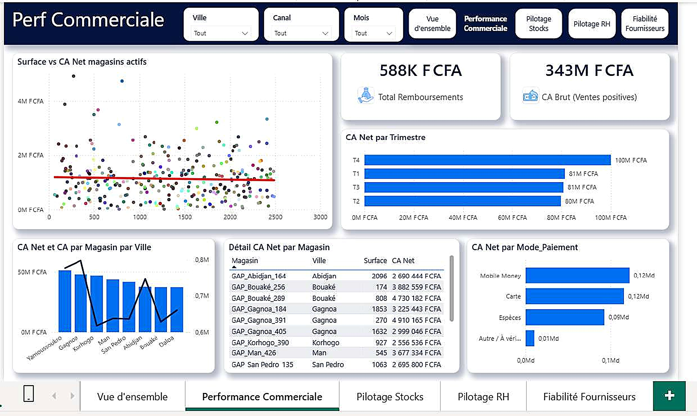
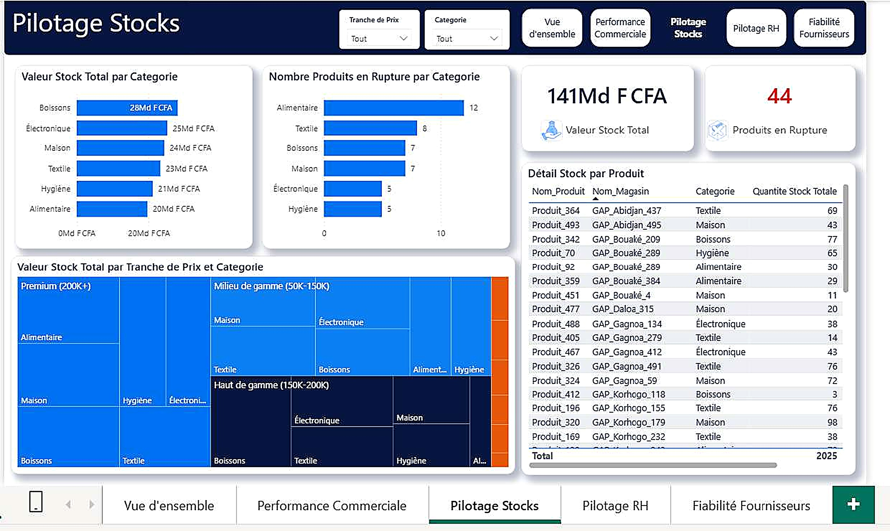
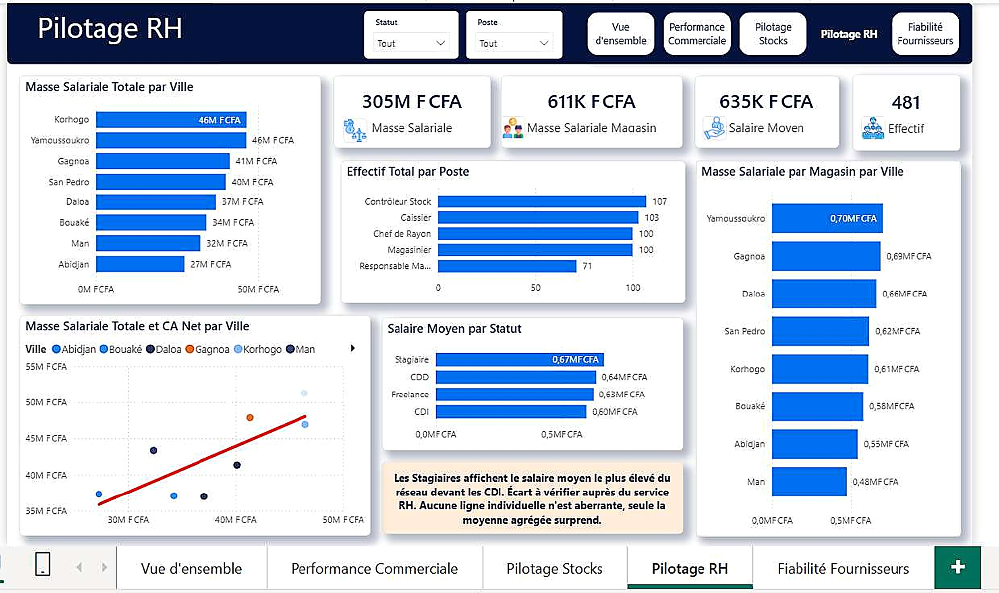

# 🛒 GAP_SERVICE — Pilotage réseau retail multi-villes (Côte d'Ivoire)

## 📌 Overview

Projet Power BI complet sur un réseau de distribution retail de 500 magasins répartis sur 8 villes de Côte d'Ivoire (Abidjan, Bouaké, Korhogo, Yamoussoukro, San Pedro, Daloa, Man, Gagnoa). Le cœur du projet n'est pas le dashboard final mais la **grille de décision appliquée à chaque anomalie détectée** : trois arbitrages métier explicites (montants négatifs, valeurs physiquement impossibles, mode de paiement anachronique), documentés avec preuves chiffrées avant tranchage — plutôt que corrigés par réflexe.

## 🎯 Business Problem

Avant de présenter un CA ou une masse salariale à un comité de direction, s'assurer que chaque anomalie détectée a été comprise avant d'être corrigée. Règle d'or appliquée sur tout le projet : **on ne corrige jamais une donnée « bizarre » sans avoir d'abord posé l'hypothèse métier, puis vérifié cette hypothèse dans les données elles-mêmes.** Séquence systématique : Observer → Formuler une hypothèse métier → Vérifier avec les chiffres → Décider → Documenter.

## ❓ Analytical Questions

- Quel est le CA total, par mois, par ville, par canal, par mode de paiement ?
- Quels magasins sous-performent ou surperforment ?
- Quelle est la valeur du stock par catégorie et par magasin ? Quels produits sont en risque de rupture ?
- Quelle est la masse salariale par magasin et par type de poste/statut ?
- Quels fournisseurs sont les plus fiables (délai court, faible taux de défaut) ?

## 📊 Dataset

- **Source** : `GAP_SERVICE_Datasets_Projet_Analyse_AVEC_ERREURS.xlsx` — jeu de données volontairement bruité pour l'exercice d'audit.
- **5 tables de 500 lignes chacune** : `Magasins`, `Ventes`, `Stocks_Produits`, `Employes`, `Fournisseurs`.
- **Clé pivot** : `ID_Magasin`, présente dans `Magasins`, `Ventes`, `Stocks_Produits` et `Employes`. `Fournisseurs` ne possède aucune clé directe vers les autres tables (traité en section Data Model).
- **Intégrité référentielle vérifiée** : 100 % des `ID_Magasin` des tables de faits existent bien dans `Magasins`. Aucun doublon d'identifiant, aucune ligne strictement dupliquée détectée dans aucune des 5 tables.

## 🔎 Data Quality — 3 décisions métier arbitrées

Trois anomalies ne pouvaient pas être tranchées par la seule observation statistique : elles ont nécessité un arbitrage métier explicite, présenté avec preuves chiffrées avant décision.

| Anomalie | Preuves chiffrées examinées | Décision retenue | Justification |
|---|---|---|---|
| **Montants de vente négatifs** (21 lignes, 4,2 %) | Négatifs : -2 346 à -47 574 FCFA vs positifs : 6 417 à 1 497 771 FCFA — profil cohérent avec des annulations partielles, pas des erreurs aléatoires de signe | Conservés tels quels, isolés via des mesures DAX dédiées (`CA Net`, `CA Brut`, `Total Remboursements`) | Modifier une donnée qu'on ne comprend pas encore est plus risqué que de la documenter et de l'isoler |
| **Valeurs négatives physiquement impossibles** (`Surface_m2`, `Quantite_Stock`, `Salaire_Mensuel`, `Delai_Livraison_Jours` — 30/28/26/29 lignes) | Distribution des valeurs négatives statistiquement cohérente avec les positives sur les 4 colonnes | Valeur absolue (`Number.Abs`) appliquée aux 4 colonnes | Ne supprime aucune ligne, n'invente aucune valeur, cohérence statistique confirmée après correction |
| **Mode de paiement « Bitcoin »** (15 lignes) | Montant moyen (674 388 FCFA) dans la même plage que les autres modes (Carte 745 827, Espèces 667 386, Mobile Money 714 542) ; réparti sur toute l'année, tous canaux, sans concentration suspecte | Recatégorisé en « Autre / À vérifier » (ni suppression, ni fusion arbitraire) | Anachronique dans un réseau physique ivoirien à modes de paiement classiques ; préserve la traçabilité plutôt que de masquer le problème |

**Grille de décision à 3 catégories** appliquée à chaque anomalie rencontrée, plus une 4ᵉ situation reconnue comme non anormale : la donnée structurellement absente (ex. `Commune`, vide pour 450 lignes sur 500 car seule Abidjan est découpée en communes — remplacée par « Non applicable », jamais imputée).

| Table | Anomalies traitées | Lignes supprimées | Résultat |
|---|---|---|---|
| Magasins | Date_Ouverture invalide (20), Surface_m2 négative (30), Ville manquante (22, reconstituée depuis `Nom_Magasin`), Commune structurellement absente (450) | 0 | 500 lignes préservées |
| Ventes | Montant_Total manquant (18, aléatoire sur 17 magasins/tous canaux/tous mois), Bitcoin recatégorisé (15), négatifs conservés (21) | 18 | 500 → 482 lignes |
| Stocks_Produits | Quantite_Stock négative (28, corrigée), Prix_Unitaire manquant (14) + Quantite_Stock manquante (20), aucune imputation fiable possible (grain unique par produit) | 34 (0 chevauchement vérifié) | 500 → 466 lignes |
| Employes | Salaire_Mensuel négatif (26, corrigé), Salaire_Mensuel manquant (19, aucune grille salariale exploitable — écart-type quasi égal à la moyenne) | 19 | 500 → 481 lignes |
| Fournisseurs | Delai_Livraison_Jours négatif (29, corrigé) + manquant (32), Taux_Defaut_% > 100 % (18, valeur sentinelle 150,0 % exacte à chaque fois — pas une erreur aléatoire) | 49 (1 chevauchement vérifié) | 500 → ~451 lignes |

**Point méthodologique retenu sur `Taux_Defaut_%`** : les 18 valeurs aberrantes sont *toutes* exactement 150,0 % — jamais 102 %, ni 187 %. Une vraie erreur de saisie produirait des valeurs variées, pas une valeur unique répétée 18 fois : interprétée comme une valeur sentinelle système plutôt qu'une vraie mesure, donc aucune correction automatique appliquée (150 % resterait de toute façon impossible même en valeur absolue).

## 🧹 Data Preparation

Ordre de nettoyage dicté par les dépendances : `Magasins` en premier (dimension centrale connectée à tout le modèle), puis les tables de faits. Reconstitution notable : `Ville` manquante (22 lignes) extraite directement du champ `Nom_Magasin` (format `GAP_<Ville>_<numéro>`) via extraction de texte entre délimiteurs — une réconciliation interne plutôt qu'une perte de données, la vraie valeur existant déjà ailleurs sur la même ligne. Vérification post-transformation : 0 valeur vide restante, 8 villes confirmées pour 500 lignes.

## 🧱 Data Model

**Question structurante : faut-il relier `Fournisseurs` au modèle ?** Cette table ne possède aucune clé directe (`ID_Magasin`, `ID_Produit`) vers les autres. Le seul lien apparent est indirect, via `Categorie_Produit` (Fournisseurs) qui partage les mêmes valeurs que `Categorie` (Stocks_Produits). Après analyse de cardinalité, décision retenue : **table indépendante, sans relation physique active.** Le lien analytique passe par un segment (slicer) partagé sur `Categorie` au niveau du rapport — une distinction méthodologique clé du projet : un lien d'analyse (niveau rapport) n'est jamais une relation de données (niveau modèle, qui agrège les lignes), et les deux ne doivent jamais être confondus.

**Schéma en étoile retenu** : une dimension centrale (`Magasins`), deux tables de faits (`Ventes`, `Stocks_Produits`), une dimension porteuse de mesures RH (`Employes`), une dimension isolée (`Fournisseurs`).

| Relation | Cardinalité | Sens de filtre |
|---|---|---|
| Magasins → Ventes | 1:* | Unique |
| Magasins → Stocks_Produits | 1:* | Unique |
| Magasins → Employes | 1:* | Unique |
| Calendrier[Date] → Ventes[Date_Vente] | 1:* | Unique |
| Fournisseurs | — | Aucune relation physique |

Toutes les relations actives sont Un-vers-plusieurs avec direction de filtre croisé Unique (jamais Les deux) — configuration la plus sûre pour éliminer tout risque de double comptage silencieux.

## 📐 Analytical Approach — mesures DAX et pièges gérés

**Table calendrier indispensable en préalable** : `CALENDAR()` génère une ligne par jour (année 2024 complète, 366 jours), enrichie via `ADDCOLUMNS` (année, trimestre, mois). Colonne `Mois N°` conservée en plus du nom en toutes lettres — sans elle, le tri par défaut afficherait les mois par ordre alphabétique plutôt que chronologique.

| Mesure / logique | Piège identifié | Solution DAX |
|---|---|---|
| `Panier Moyen`, `Salaire Moyen` | Un magasin filtré sans aucune vente/employé génère une erreur `#DIV/0!` avec l'opérateur `/` classique | `DIVIDE(numérateur, dénominateur, valeur_si_erreur)` systématique — règle retenue pour tout le projet : ne plus jamais utiliser `/` directement |
| `CA Brut (Ventes positives)` | Isoler uniquement les lignes positives sans modifier le contexte de filtre global | `CALCULATE` avec condition additionnelle sur le signe du montant |
| `Total Remboursements` | Le signe négatif natif des remboursements, affiché tel quel sur une carte KPI, est déroutant pour un décideur | Inversion explicite (`× -1`) documentée comme point de vigilance à ne pas oublier |
| `Nombre de Ventes` | `COUNT` sur une colonne précise dépend du choix de cette colonne et des valeurs vides restantes | `COUNTROWS` — insensible au choix de colonne |
| `Valeur Stock Total` | Un calcul ligne par ligne (prix × quantité) n'a de sens qu'agrégé, jamais consulté isolément | `SUMX` (fonction itérative) plutôt qu'une colonne calculée stockée — respecte dynamiquement tout filtre du rapport |
| **`Magasins Sans Vente`** (mesure la plus avancée du projet) | Compter les magasins jamais apparus dans `Ventes`, indépendamment des filtres de page actifs | `VAR`/`RETURN` avec `VALUES(Ventes[ID_Magasin])` et `CALCULATETABLE(..., ALL(Ventes))` pour retirer temporairement tout filtre actif avant la soustraction finale — résultat validé : **195 magasins sur 500 (39 %)** sans aucune vente enregistrée |

**Colonnes calculées vs mesures** : règle de décision unique appliquée sur tout le projet — si le résultat doit changer selon les filtres du rapport, c'est une mesure ; si c'est une caractéristique fixe propre à chaque ligne, c'est une colonne. Exemple géré : `Ancienneté (années)` sur `Magasins`, où `DATEDIFF` sur une `Date_Ouverture` vide renvoie `BLANK()` — comportement volontaire, on ne veut surtout pas inventer une ancienneté pour un magasin dont la vraie date est inconnue. `Tranche Ancienneté` utilise `SWITCH(TRUE(), ...)` avec le cas `ISBLANK` volontairement testé en premier, pour ne jamais laisser une ligne sans date glisser silencieusement dans une autre catégorie.

## 📊 Dashboard

### Page 1 — Vue d'ensemble
**Objectif :** synthèse pilotable pour un dirigeant en quelques secondes.
**KPI :** CA Net (342 M FCFA), Ventes (482), Panier Moyen (710K FCFA), Valeur Stock (141 Md FCFA), **Magasins Sans Vente (195)** — positionné volontairement dès la première page : un signal qui remet en question la complétude des données doit être visible immédiatement, pas enterré dans une sous-page.
**Analyses :** % Magasins Actifs Cumulé par Mois, jauge % Magasins Actifs (61 %), CA Net par Canal (donut), CA Net par Ville, CA Net par Mois.


### Page 2 — Performance Commerciale
**Objectif :** creuser la performance par magasin, ville et mode de paiement.
**KPI :** Total Remboursements (588K FCFA), CA Brut / Ventes positives (343M FCFA).
**Analyses :** Surface vs CA Net des magasins actifs (nuage de points), CA Net par Trimestre, CA Net et CA par Magasin par Ville, Détail CA Net par Magasin (tableau), CA Net par Mode de Paiement — avec la catégorie « Autre / À vérifier » explicitement visible plutôt que masquée.



### Page 3 — Pilotage Stocks
**Objectif :** valoriser l'inventaire et anticiper les ruptures.
**KPI :** Valeur Stock Total (141 Md FCFA), Produits en Rupture (44).
**Analyses :** Valeur Stock Total par Catégorie, Nombre Produits en Rupture par Catégorie, Treemap Valeur Stock Total par Tranche de Prix × Catégorie, Détail Stock par Produit (tableau).



### Page 4 — Pilotage RH
**Objectif :** piloter la masse salariale et les effectifs.
**KPI :** Masse Salariale (305M FCFA), Masse Salariale/Magasin (611K FCFA), Salaire Moyen (635K FCFA), Effectif (481).
**Analyses :** Masse Salariale Totale par Ville, Effectif Total par Poste, Masse Salariale par Magasin par Ville, Masse Salariale et CA Net par Ville, Salaire Moyen par Statut.
**Zone de texte d'avertissement intégrée directement au dashboard** : *« Les Stagiaires affichent le salaire moyen le plus élevé du réseau devant les CDI. Écart à vérifier auprès du service RH. Aucune ligne individuelle n'est aberrante, seule la moyenne agrégée surprend. »* — l'observation est signalée, pas corrigée ni masquée.



### Page 5 — Fiabilité Fournisseurs
**Objectif :** identifier les fournisseurs lents et peu fiables.
**KPI :** Fournisseurs (451), Délai Livraison Moyen (14,72 jours).
**Analyses :** Délai de livraison et taux de défaut par catégorie de produit, Taux Défaut Moyen par Catégorie Produit, Détail Fournisseurs (tableau triable), nuage de points Délai Livraison Moyen × Taux Défaut Moyen par fournisseur — le cadran supérieur droit identifie visuellement les fournisseurs lents *et* peu fiables.


## 🔑 Key Insights

- **Observation :** en CA total brut, Yamoussoukro (51,3 M FCFA) devance largement Abidjan (37,3 M FCFA), qui se classe même avant-dernière sur 8 villes. **Interprétation :** lecture trompeuse — un CA total n'a de sens que rapporté au nombre de magasins qui le produisent. Une fois normalisé, Korhogo (le plus grand nombre de magasins du réseau, 76) affiche le CA par magasin le plus faible, tandis que Gagnoa (60 magasins) génère la meilleure performance par point de vente. **Implication métier :** ne jamais comparer des totaux entre groupes de taille différente sans les normaliser — une stratégie d'expansion pilotée uniquement par le nombre d'ouvertures n'est pas garante de performance.
- **Observation :** 195 magasins sur 500 (39 %) n'apparaissent dans aucune transaction enregistrée sur la période. **Interprétation :** ce chiffre conditionne la fiabilité de toute décision basée sur le CA — soit ces magasins sont réellement inactifs (signal d'alerte business majeur), soit il s'agit d'une limite d'extraction des données (l'analyse actuelle ne porterait alors que sur 61 % du réseau réel). **Implication métier :** vérifier en priorité l'origine de cet écart auprès de l'équipe SI/données, avant toute autre décision stratégique basée sur ce dashboard.
- **Observation :** 9,4 % du catalogue produit (44/466) est en zone d'alerte de stock bas, concentré à 27 % sur la catégorie Alimentaire — largement devant les autres catégories. **Interprétation :** compte tenu de la rotation rapide typique de l'alimentaire, ce risque de rupture non anticipé impacte directement le CA et la satisfaction client. **Implication métier :** seuil de réapprovisionnement automatique différencié pour l'Alimentaire, avec une fréquence de revue plus courte.
- **Observation :** les Stagiaires affichent le salaire moyen le plus élevé du réseau (670 503 FCFA), devant les CDD, les Freelances, et même les CDI (597 568, en dernière position). **Interprétation :** ce résultat ne reflète probablement pas la politique salariale réelle — signal d'une erreur de saisie ou de classification des contrats plutôt qu'un fait métier validé. **Implication métier :** ne pas exploiter ce chiffre en l'état pour des décisions RH ; transmettre au service RH pour validation avant toute communication.
- **Observation :** la catégorie Textile cumule le taux de défaut fournisseur le plus élevé (≈2,80 %) et un délai de livraison parmi les plus longs (≈14,6 jours). **Interprétation :** double fragilité opérationnelle qui distingue cette catégorie de toutes les autres. **Implication métier :** risque de ruptures en cascade si rien n'est entrepris — revue prioritaire du panel fournisseurs Textile.

## 💡 Business Recommendations

- Auditer le modèle opérationnel des magasins de Korhogo (taille, emplacement, offre produit) en le comparant à Gagnoa, avant toute nouvelle décision d'ouverture dans cette zone.
- Vérifier en priorité, auprès de l'équipe SI/données, l'origine des 195 magasins sans vente enregistrée — ce point conditionne la fiabilité de tout le reste de l'analyse.
- Mettre en place un seuil de réapprovisionnement automatique différencié pour la catégorie Alimentaire, avec une fréquence de revue plus courte.
- Ne pas exploiter le classement salarial Stagiaires > CDI pour des décisions RH tant que le service RH n'a pas validé l'observation.
- Engager une revue du panel fournisseurs Textile, avec attention particulière sur les fournisseurs au taux de défaut le plus élevé.

## 🛠️ Technologies

Power BI Desktop · Power Query (M) · DAX (`DIVIDE`, `CALCULATE`, `SUMX`, `CALCULATETABLE`, `ALL`, `VALUES`, `SWITCH(TRUE())`, `VAR`/`RETURN`, `DATEDIFF`) · Modélisation en étoile

## 📁 Project Structure

```text
GAP_SERVICE/
├── README.md
├── screenshots/
│   ├── 01_Vue_ensemble.jpg
│   ├── 02_Performance_commerciale.jpg
│   ├── 03_Pilotage_stocks.jpg
│   ├── 04_Pilotage_RH.jpg
│   └── 05_Fiabilite_fournisseurs.jpg
├── documentation/
│   └── GAP_SERVICE_Documentation_Projet_BI.docx   # journal complet : audit, nettoyage, modélisation, DAX, storytelling
├── data/
│   └── GAP_SERVICE_Datasets_Projet_Analyse_AVEC_ERREURS.xlsx
└── pbix/
    └── GAP_SERVICE.pbix   # ⚠️ à déposer manuellement (non fourni dans cet échange)
```

## ▶️ How to Explore

`[À COMPLÉTER EN LOCAL]` — préciser si le `.pbix` et le dataset seront publiés tels quels, ou si seuls les captures et la documentation seront disponibles publiquement.

## ⚠️ Limitations

- Le dataset est un jeu d'exercice volontairement bruité — les 5 arbitrages métier documentés relèvent d'un raisonnement transposable, pas d'une vraie confirmation terrain (ex. la nature exacte des montants négatifs en Ventes reste une hypothèse tant qu'aucune colonne `Type_Transaction` n'existe réellement dans le système source).
- 39 % du réseau (195 magasins) sans vente enregistrée reste une zone d'ombre non résolue : toute lecture de performance commerciale actuelle ne porte que sur 61 % du réseau, tant que l'origine de cet écart n'est pas confirmée.
- Aucune grille salariale ou grille de délai de livraison fiable n'a pu être établie par poste/catégorie (écarts-types quasi égaux aux moyennes) — empêche toute imputation crédible des valeurs manquantes correspondantes, d'où leur suppression plutôt qu'un remplacement estimé.
- `Fournisseurs` reste une dimension isolée du modèle de données : toute analyse croisant fournisseur et magasin (au-delà de la catégorie de produit) nécessiterait l'ajout d'une vraie clé (`ID_Fournisseur`) côté source.

## 🚀 Future Improvements

- Ajouter une colonne `Type_Transaction` dans `Ventes` côté système source, pour distinguer formellement vente et remboursement plutôt que de l'inférer du signe.
- Réintégrer `Fournisseurs` au modèle relationnel dès qu'une vraie clé de jointure existe dans le système source.
- Construire un score de risque combiné fournisseur (délai × taux de défaut) au-delà du nuage de points actuel, pour prioriser automatiquement les audits.
- Étendre la table Calendrier à plusieurs années dès que l'historique de vente dépassera 2024, pour activer des comparaisons YoY.

---

## 🎓 Skills Demonstrated

| Compétence | Preuve |
|---|---|
| Data Quality | Trois arbitrages métier documentés avec preuves chiffrées avant décision (montants négatifs, valeurs impossibles, mode de paiement anachronique), plutôt que corrections réflexes |
| DAX (niveau avancé) | Mesure `Magasins Sans Vente` combinant `VAR`/`RETURN`, `VALUES`, `CALCULATETABLE(..., ALL(...))` pour un comptage indépendant du filtre de page actif |
| Power Query (M) | Reconstitution de `Ville` par extraction de texte depuis `Nom_Magasin` (réconciliation interne plutôt que suppression), pattern `try...otherwise null` pour robustesse |
| Data Modeling | Distinction explicite entre lien d'analyse (slicer partagé, niveau rapport) et relation de données (niveau modèle) pour `Fournisseurs`, plutôt qu'une relation forcée sur une clé indirecte |
| Statistics | Détection d'une valeur sentinelle (150,0 % répétée exactement 18 fois) distinguée d'une vraie erreur aléatoire, par analyse de la distribution plutôt que par simple seuillage |
| Business Analysis | Normalisation d'un CA brut trompeur par le nombre de magasins pour révéler le vrai paradoxe Korhogo/Gagnoa ; recommandations priorisées et actionnables pour un comité de direction |
| Problem Solving | Vérification systématique du chevauchement entre anomalies avant de calculer un nombre de lignes final (ex. Fournisseurs : delai manquant × taux > 100 %) |
