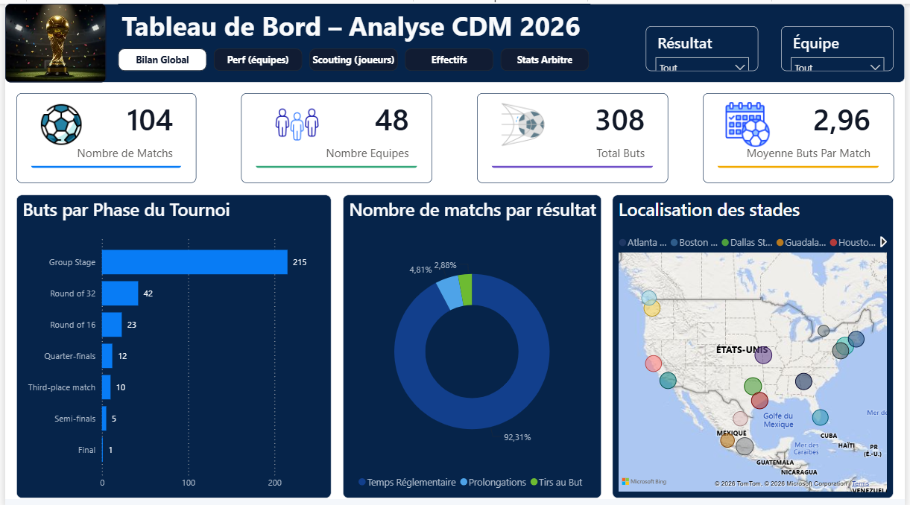
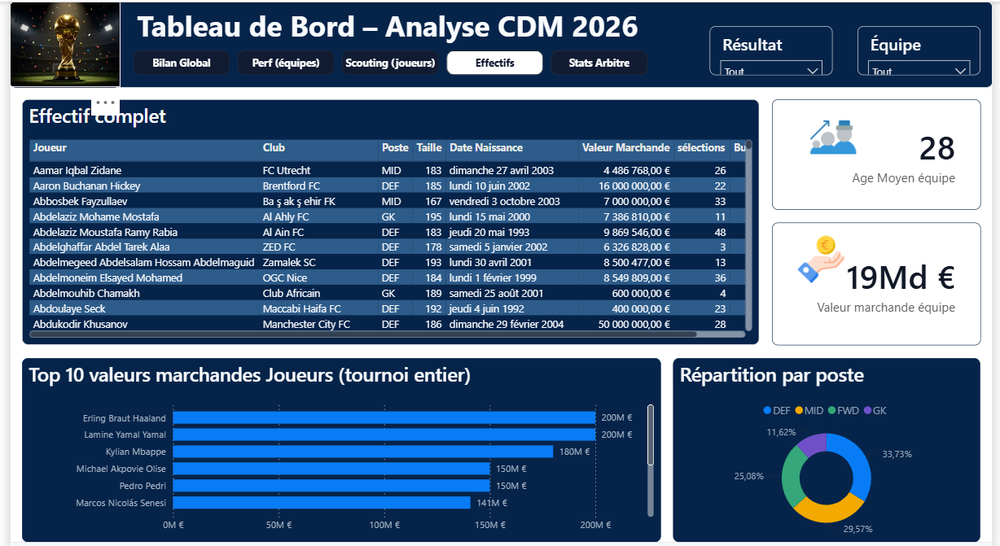
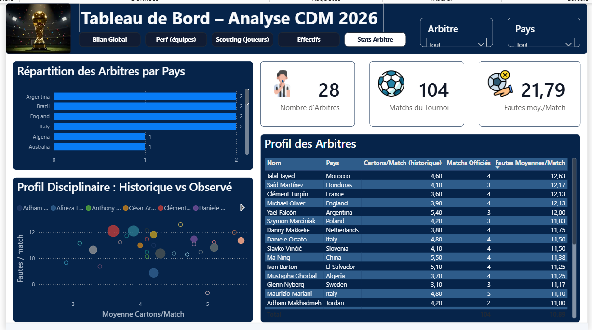

# 🏆 Analyse Coupe du Monde FIFA 2026 — Football Analytics

## 🎯 Objectif

Construire un dashboard Power BI professionnel de **Football Analytics** sur la Coupe du Monde FIFA 2026 (48 équipes, 104 matchs, 12 groupes de 4), destiné à un usage portfolio Data Analyst / BI.

**Périmètre analytique :**
- Performances des équipes (attaque, défense, possession)
- Performances individuelles des joueurs
- Résultats de matchs, xG, tirs et occasions
- Parcours dans la compétition (phases de groupes → finale)
- Comparaisons et tendances entre équipes et joueurs

**Parties prenantes ciblées :** analyste sportif / staff technique, recruteur, journaliste sportif, direction sportive — chacune avec un besoin d'usage distinct couvert par une page dédiée du dashboard.

## 🧩 Contexte

Projet mené avec une démarche d'audit rigoureuse : **14 fichiers CSV sources** inspectés individuellement (structure, granularité, unicité des clés, valeurs manquantes, doublons, cohérence inter-tables) avant toute construction du modèle. Chaque anomalie détectée a été documentée avec son mécanisme, sa méthode de vérification et la décision retenue — démarche traçable de bout en bout, incluant une correction post-clôture sur le score de la finale, découverte et corrigée après confrontation à des sources externes.

## 🔗 Sources de données

- **14 fichiers CSV** : équipes, matchs, statistiques d'équipe par match, effectifs et joueurs, statistiques joueurs, compositions de match, événements de match, arbitres, stades, phases de tournoi (+ 3 fichiers orientés Machine Learning, hors périmètre BI)
- Volumes principaux : 48 équipes, 104 matchs, 1 248 joueurs convoqués, 5 408 lignes de composition, 601 événements de match, 28 arbitres, 16 stades
- ⚠️ **Limites de données assumées et documentées** : pas de statistiques défensives avancées (tacles, interceptions) : la table `match_events` est structurellement incomplète sur 4 matchs et ne recense qu'une fraction des cartons réels — jamais utilisée pour un total agrégé, uniquement pour le détail ponctuel

## 📈 KPIs

| KPI | Ce qu'il mesure |
|---|---|
| Total Buts / Moyenne Buts par Match | Rythme offensif global du tournoi |
| Points, Victoires, Différentiel de buts | Classement et performance globale par équipe |
| Buts moins xG | Sur/sous-performance de finition par rapport à la qualité des occasions |
| Possession moyenne vs Note Elo | Test de causalité possession ↔ résultat |
| Rang buteurs, Passes décisives /90 | Classement et contribution offensive des joueurs |
| Valeur marchande totale, Âge moyen | Profil démographique et économique des effectifs |
| Fautes moyennes / match, Cartons (historique) | Profil disciplinaire des arbitres |

## 🔍 Analyses réalisées

**Audit et qualité des données** — Traitement méthodique de plusieurs anomalies réelles : incohérence de somme de possession sur 24 matchs (corrigée par rescale proportionnel plutôt que par exclusion), colonnes structurellement vides supprimées (`shots`, `shots_on_target`, `average_rating`), doublon fonctionnel entre deux tables de même granularité (une désactivée du chargement plutôt que supprimée), relation 1-à-1 détectée entre deux tables d'origine différente puis fusionnées en une table `Joueurs` unique.

**Modélisation en étoile** — Faits multiples (`Matchs`, `Statistiques_equipes_match`, `Compositions_match`, `Evenements_match`, `Joueurs`) reliés à des dimensions communes (`Equipes`, `Arbitres`, `Stades`, `Phases_tournoi`). Gestion explicite des chemins ambigus et relations multiples vers une même dimension (deux colonnes de rôle domicile/extérieur vers `Equipes`) via relations actives/inactives et `USERELATIONSHIP`.

**Power Query (M)** — Pièges techniques documentés et corrigés : conversion décimale dépendante de la culture régionale (`en-US` forcé explicitement pour éviter une erreur silencieuse ×10 sur les valeurs décimales), conversion texte "0"/"1" vers type logique en deux étapes, référence circulaire entre requêtes résolue par une requête intermédiaire dédiée.

**DAX** — Mesures équipe gérant séparément les rôles domicile/extérieur (`ALL(Matchs)` + `FILTER`), protection systématique contre la propagation du blanc dans les multiplications (`COALESCE`), diagnostic et correction d'un bug de produit cartésien dans un visuel combinant deux champs identifiants.

**Correction post-clôture** — Une erreur de score sur la finale (Espagne–Argentine) a été détectée après la clôture initiale du projet, par confrontation à 3 sources externes indépendantes et concordantes, puis corrigée en Power Query par une colonne conditionnelle ciblée sur la clé du match concerné (pas de remplacement global de valeur). Un audit complémentaire sur les demi-finales et le match pour la 3e place a confirmé l'anomalie comme isolée.

**Storytelling** — Analyse critique de la corrélation possession/résultat : trois hypothèses alternatives à la causalité directe ont été formulées et testées (qualité intrinsèque de l'équipe, niveau de l'adversaire, causalité inverse liée au score), avec un test empirique via la corrélation possession moyenne / classement Elo pré-tournoi (r = 0,73).

## 🛠️ Technologies utilisées

- **Power BI Desktop** (Power Query, modèle de données, DAX)
- **Power Query (M)** pour l'audit, le nettoyage et la fusion des tables sources
- **DAX** pour les mesures, colonnes et table calculées
- Thème visuel personnalisé (`Theme_CDM2026.json` — palette navy/vert/ambre/rouge, typographie Segoe UI)

## 🖼️ Aperçu du dashboard

Le rapport comprend **5 pages**, chacune répondant à une question métier précise pour un public décisionnel distinct.

### Bilan Global — quel est le bilan global du tournoi ?


### Performance (équipes) — quelles équipes ont le mieux performé, et pourquoi ?


### Scouting (joueurs) — qui sont les joueurs les plus performants ?


### Effectifs — quel est le profil démographique et économique des effectifs ?


### Stats Arbitre — le profil d'un arbitre influence-t-il le déroulement des matchs ?


## 💡 Insights clés

- La possession moyenne est fortement corrélée à la force pré-tournoi des équipes (Elo, r = 0,73) — elle reflète surtout le niveau global d'une équipe plutôt qu'elle n'est, à elle seule, un facteur causal de victoire.
- Un écart buts − xG sur un tournoi (3 à 7 matchs par équipe) doit être lu comme une observation descriptive ponctuelle, jamais comme une preuve durable de talent de finisseur — un échantillon trop restreint pour trancher.
- La complétude structurelle d'une table (aucune ligne manquante) et l'exactitude de chaque valeur sont deux qualités indépendantes : l'une se vérifie par comptage, l'autre uniquement par recoupement avec des sources externes — illustré concrètement par l'erreur de score détectée sur la finale après la clôture initiale de l'audit.

## 📂 Contenu du dossier

```text
analyse-coupe-du-monde-fifa-2026/
├── README.md
├── data/                              # Données sources (à compléter)
├── screenshots/                       # Captures des 5 pages du dashboard
├── documentation/
│   └── Documentation_Methodologique.docx   # Audit complet, code Power Query, DAX, évaluation critique
└── analyse-coupe-du-monde-fifa-2026.pbix   # à ajouter
```

> 📝 Le dossier `documentation/` contient le journal de bord complet du projet : audit des 14 tables sources, code Power Query table par table, modélisation en étoile, toutes les mesures DAX, conception du dashboard, storytelling, thème visuel et évaluation critique.
