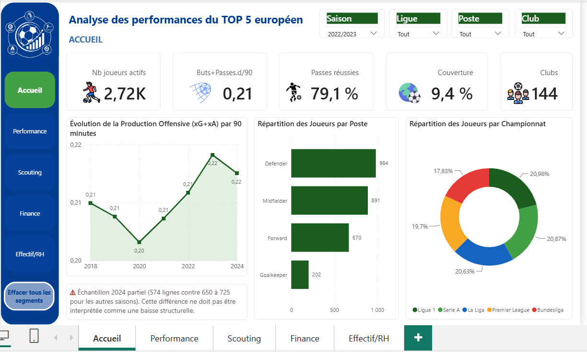
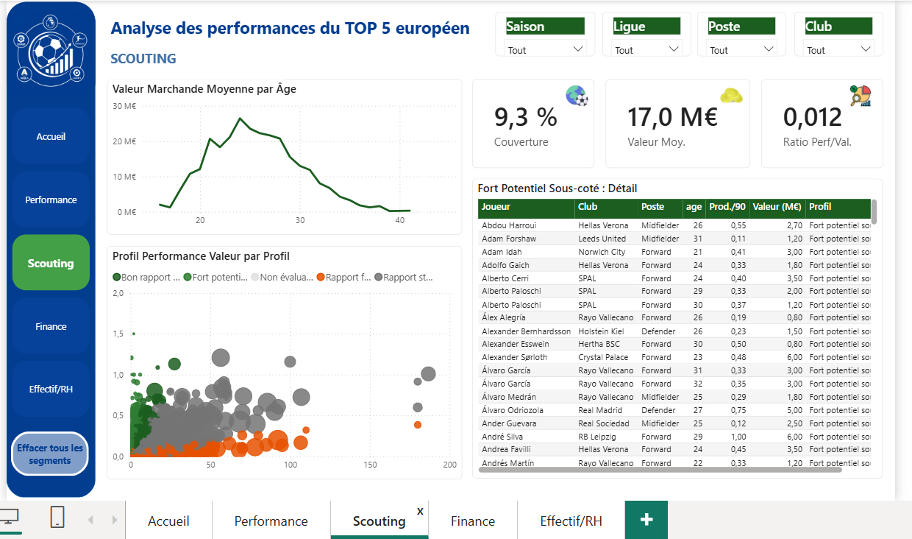

# ⚽ Analyse de Performance, Scouting et Valorisation Financière — Football Européen (Big 5)

## 🎯 Objectif

Construire une **Vue 360°** du football professionnel européen de haut niveau, combinant trois angles d'analyse dans un seul dashboard décisionnel :
- **Performance sportive** — classements, comparaisons, efficacité
- **Scouting & recrutement** — identification de profils sous-cotés
- **Analyse financière** — valeur marchande, masse salariale, retour sur investissement

L'objectif business a été validé dès le cadrage : couvrir les trois angles simultanément, sans qu'aucun ne soit sacrifié au profit d'un autre.

## 🧩 Contexte

Projet réalisé dans le cadre d'un travail méthodologique approfondi (cadrage métier → préparation des données → modélisation → DAX → dashboard → storytelling), avec traçabilité complète des décisions techniques et de leurs justifications métier.

Le secteur analysé — football professionnel européen — combine deux dimensions rarement réunies dans un même projet : la **performance sportive quantitative** (statistiques de jeu) et l'**économie du joueur** (valeur marchande, salaires).

## 🔗 Sources de données

- **12 fichiers sources** décrivant les statistiques de joueurs des **5 grands championnats européens** (Premier League, Ligue 1, La Liga, Bundesliga, Serie A) sur la période **2018–2024**
- Données enrichies de statistiques financières (valeur marchande, salaires, frais de transfert) pour un **sous-ensemble de 18 clubs sur 144**
- Volumes principaux : ~19 270 lignes de statistiques de champ, 1 305 lignes gardiens, 2 047 lignes de valorisation financière
- ⚠️ La couverture financière est partielle (18/144 clubs) — une mesure DAX dédiée (`% Couverture Valorisation`) est affichée en permanence pour éviter toute surinterprétation d'un échantillon partiel

## 📈 KPIs

| KPI | Ce qu'il mesure |
|---|---|
| Buts + Passes décisives /90 | Production offensive normalisée par le temps de jeu |
| xG/90 et Buts − xG | Volume d'occasions créées vs efficacité de finition réelle |
| % Passes réussies | Profil du joueur (sécuritaire vs porteur de risque) |
| Actions défensives /90 | KPI défensif central pour les profils hors attaque |
| Ratio Performance / Valeur | Cœur de l'angle scouting — détecte les joueurs sous-cotés |
| % Effectif utilisé | Taux d'utilisation réelle de l'effectif sous contrat |
| % Arrêts / Clean sheets | KPIs gardien dédiés |

## 🔍 Analyses réalisées

**Modélisation** — Schéma en étoile à faits multiples : `Fact_Performance` (table de faits principale, ~171 colonnes, fusion de 8 tables de statistiques de champ + temps de jeu) et `Fact_Performance_GK` (table séparée pour les gardiens), toutes deux reliées aux dimensions partagées `Dim_Joueur`, `Dim_Club`, `Dim_Competition`, `Dim_Saison`, `Dim_Position`. La table `valuations` (financier) est reliée uniquement à ces tables de faits, jamais directement aux dimensions.

**Qualité des données** — Audit et traitement systématique : déduplication des clés de jointure (`Table.Distinct`), gestion des homonymes de joueurs (clé composite `player + born`, 40 cas confirmés), détection de colonnes dupliquées sous des noms différents (ex. `ga` = `goals_against`), correction d'une cardinalité de relation inversée.

**DAX** — Toutes les mesures suivent le principe *"ne jamais moyenner un ratio déjà calculé"* : ressommer les valeurs brutes (numérateur/dénominateur) puis diviser une seule fois via `DIVIDE()`, plutôt que d'utiliser `AVERAGE()` sur des colonnes de ratio déjà calculées. Mesures d'écart à la moyenne du poste construites avec `ALLEXCEPT` pour des comparaisons dynamiques selon le contexte de filtre.

**Exploration** — Corrélation performance ↔ valeur marchande mesurée à 0,42 (lien réel mais modéré) ; corrélation âge ↔ performance quasi nulle (−0,047) alors que la valeur marchande décline nettement après 27–28 ans ; volatilité saison par saison de la sur/sous-performance de finition (Buts − xG), y compris chez les meilleurs finisseurs.

**Segmentation scouting** — Colonne calculée `Profil Performance Valeur` classant chaque joueur (Fort potentiel sous-coté / Bon rapport / Standard / Rapport faible) selon un ratio production offensive / valeur marchande, avec seuils calibrés empiriquement sur la distribution réelle des quartiles.

## 🛠️ Technologies utilisées

- **Power BI Desktop** (Power Query, modèle de données, DAX)
- **Power Query (M)** pour la préparation et la fusion des tables sources
- **DAX** pour les mesures et colonnes calculées

## 🖼️ Aperçu du dashboard

Le rapport comprend **5 pages**, chacune dédiée à un angle métier et un public décisionnel distinct. Filtres globaux (Saison, Compétition, Position) communs à toutes les pages ; filtre Club en local sur les pages Performance et Scouting.

### Accueil — synthèse et état des lieux global


### Performance — classements et comparaisons


### Scouting — profils sous-cotés et courbe de valeur par âge


### Finance — masse salariale et salaire vs production


### Effectif / RH — utilisation de l'effectif


## 💡 Insights clés

- La performance et la valeur marchande sont liées, mais modérément (corrélation 0,42) — la notoriété et le potentiel perçu pèsent autant que la production statistique pure.
- Le marché surpaie la jeunesse, pas la performance : le pic de valorisation se situe entre 22 et 24 ans, alors que la performance pure ne décline presque pas avec l'âge.
- La sur/sous-performance de finition (Buts − xG) est volatile d'une saison à l'autre, y compris pour les meilleurs finisseurs — pas un trait stable du joueur.

## 📂 Contenu du dossier

```text
analyse-performance-football-europe/
├── README.md
├── data/                             # Données sources (à compléter)
├── screenshots/                      # Captures des 5 pages du dashboard
├── documentation/
│   └── Documentation_Methodologique.docx   # Raisonnement détaillé, code Power Query, mesures DAX
└── analyse-performance-football-europe.pbix   # à ajouter
```

> 📝 Le dossier `documentation/` contient le document méthodologique complet : compréhension métier, audit qualité, code Power Query (M), modélisation en étoile, toutes les mesures DAX et leurs justifications.
