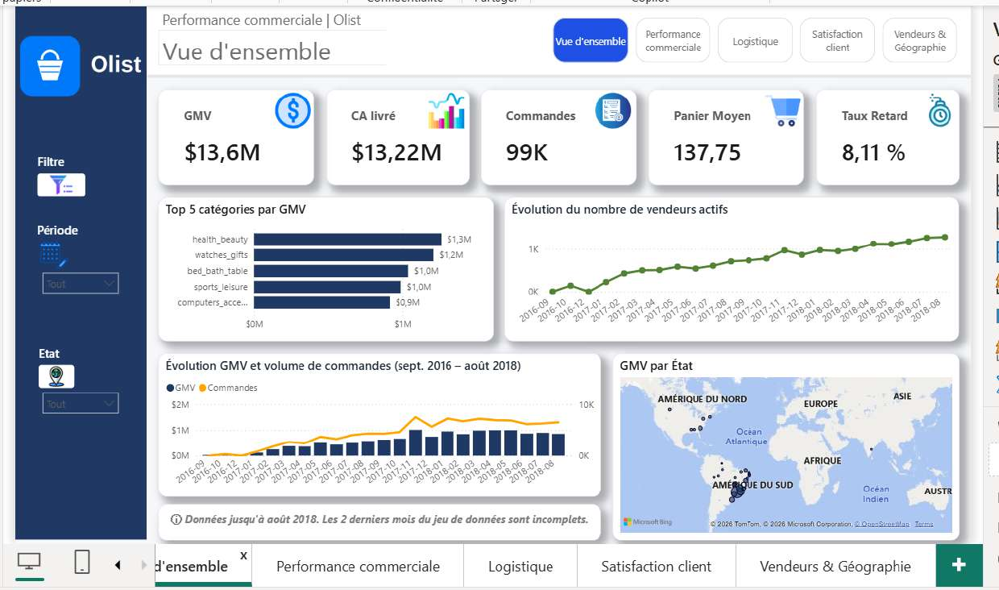
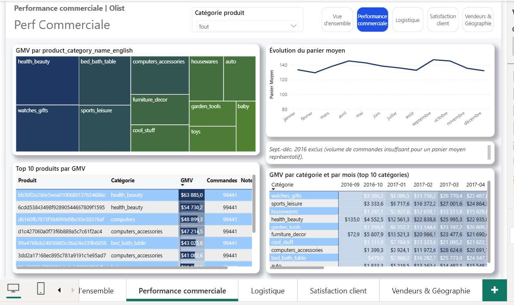
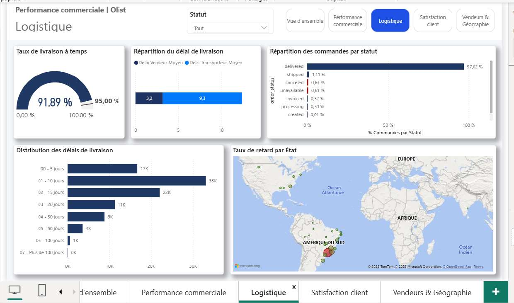
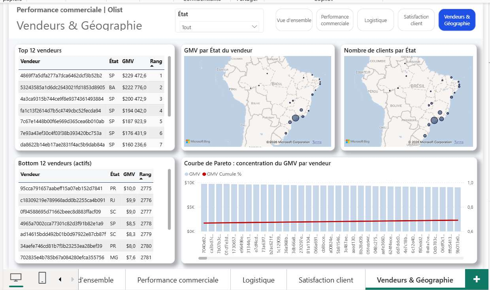

# 📊 Marketplace e-commerce Olist (Brésil) — Modèle en constellation, mesures DAX & dashboard décisionnel

## 📌 Overview

Projet Power BI complet mené de bout en bout sur le dataset Olist, une marketplace e-commerce multi-vendeurs brésilienne (99 441 commandes, 13,6 M R$ de GMV, 96 096 clients, 3 095 vendeurs, sept. 2016 – oct. 2018). Le cœur du projet n'est pas le dashboard final mais la **rigueur de modélisation qui l'a précédé** : un modèle en constellation conçu spécifiquement pour éviter les biais de sur-comptage, deux pièges de filtrage diagnostiqués et corrigés (dont un écart mesuré de 96 096 vs 9 145 sur une mesure de comptage client), et un insight central — la ponctualité de livraison — qui domine largement tout autre facteur testé.

## 🎯 Business Problem

Avant de présenter des KPIs à un comité de direction, s'assurer qu'ils sont exacts — pas seulement qu'ils s'affichent. `order_items` (grain produit), `payments` (grain paiement) et `reviews` (grain avis) ont des grains différents : les relier directement entre elles créerait un sur-comptage silencieux du CA. Ce projet documente la méthode retenue pour l'éviter, et la démarche de vérification qui a permis d'identifier un cas réel où un filtre posé sur une dimension ne remontait pas vers les mesures censées en dépendre.

## ❓ Analytical Questions

- Quelle est l'évolution du chiffre d'affaires et du volume de commandes dans le temps ?
- Quels vendeurs et quelles catégories de produits génèrent le plus de valeur ?
- Les commandes sont-elles livrées dans les délais promis, et où se situent les retards ?
- Quel est l'impact réel des retards de livraison sur la satisfaction client ?
- Comment le chiffre d'affaires et la clientèle se répartissent-ils géographiquement ?
- Quelle part des vendeurs concentre l'essentiel de l'activité, et quel est le risque associé ?

## 📊 Dataset

- **Source** : [Olist Brazilian E-Commerce](https://www.kaggle.com/datasets/olistbr/brazilian-ecommerce)
- **9 fichiers CSV sources**, couvrant tout le cycle de vente : commande, produit, vendeur, client, paiement, avis, géolocalisation.
- **Logique relationnelle** : `orders` est le pivot du modèle (une commande = une ligne). `order_items`, `payments` et `reviews` s'y rattachent chacune à un grain différent. `geolocation`, volumineuse (1 000 163 lignes) et au grain « relevé GPS », est retraitée puis fusionnée dans `customers` et `sellers` plutôt que conservée comme table indépendante.
- **Identification client à double niveau** : `customer_id` (technique, par commande) vs `customer_unique_id` (réel, stable) — distinction centrale pour toute la suite du projet.

## 🔎 Data Quality

| Anomalie / point vérifié | Détection | Traitement | Impact |
|---|---|---|---|
| Concordance montants payments ↔ order_items | Recoupement `payment_value` total vs `price + freight_value` par commande | Vérifié : 99,69 % de concordance à 1 centime près | Confirme la fiabilité globale des montants malgré l'écart de 1,04 % au global |
| Cohérence temporelle achat/livraison | Contrôle systématique des dates de cycle de vie de commande | Aucune anomalie détectée (0 commande livrée avant achat) | Valide la fiabilité du cœur transactionnel |
| Doublons sur clés primaires | Contrôle `orders`, `products`, `sellers` | Aucun doublon strict détecté | Confirme l'intégrité référentielle de base |
| 610 produits sans catégorie | Détection de `product_category_name` null | Non supprimés (créerait des clés étrangères orphelines) : valeur `nao_informado`, traduite en `Unknown` | Préserve de vraies ventes dans les analyses par catégorie plutôt que de les exclure silencieusement |
| 278 clients (0,28 %) sans correspondance géographique | Left Outer Join `customers` ↔ `geolocation_clean` | Conservés (un client reste comptabilisé en CA/commandes même sans GPS) ; ville → « Localisation inconnue » | Évite une sous-estimation silencieuse du CA client |
| 8 commandes « delivered » sans date de livraison | Contrôle croisé statut / date | Flag de traçabilité `anomalie_livree_sans_date` créé, non corrigé arbitrairement | Rend l'anomalie visible et traçable plutôt que masquée |
| 551 doublons d'avis (547 `order_id` concernés) | Un avis attendu par commande, plusieurs trouvés | Règle déterministe : conservation du plus récent (`review_answer_timestamp`), vérifiée sans égalité parfaite de timestamp | 99 224 → 98 673 lignes, garantit une ligne par commande dans `reviews` |
| Géolocalisation à 26 % de doublons (52,6 lignes/code postal en moyenne) | Table brute `geolocation` (1 000 163 lignes) | Regroupement par code postal : moyenne pour lat/lng, mode pour ville/État | 1 000 163 → ≈ 19 000 lignes ; règle au passage 8 cas de codes postaux à États multiples |

## 🧹 Data Preparation

Ordre de traitement dicté par les dépendances entre tables (jamais arbitraire) : `geolocation` en premier (référence dont dépendent `customers`/`sellers`), puis `products`/`category_translation` (dimensions simples), puis `customers`/`sellers` (enrichies), et enfin les tables transactionnelles `orders`/`order_items`/`payments`/`reviews` en dernier (dépendantes des autres pour les contrôles de cohérence). Colonne `date_reference_ca_livre` créée sur `orders` avec repli en cascade (date livraison client → date remise transporteur → date achat) pour ne jamais perdre une commande d'un graphique temporel. `category_translation` complétée de 2 catégories absentes + un membre « Inconnu » pour fiabiliser toute jointure ultérieure depuis `products`.

## 🧱 Data Model

**Principe directeur : éviter le fan-out.** Une commande à 3 articles payée en 2 fois donnerait, si `order_items` et `payments` étaient reliées directement, 3 × 2 = 6 lignes dans un visuel croisant les deux — un sur-comptage silencieux du CA. Règle appliquée dans tout le modèle : ne jamais relier deux tables de faits entre elles ; chacune se relie uniquement à des dimensions communes (`orders`, `products`, `sellers`). Ce type de modèle porte un nom : **schéma en constellation** (galaxy schema).

**Deux pièges de modélisation identifiés et résolus :**
- *Relation 1:1 inattendue* — `customer_id` est généré par commande (pas par client réel), donc la relation `customers` ↔ `orders` est 1:1 et non 1:N comme attendu d'une dimension classique. Sens de filtrage choisi : `customers → orders`.
- *Chemin ambigu (relation en losange)* — charger `geolocation_clean` et `category_translation` comme tables séparées en plus d'être fusionnées dans `customers`/`sellers`/`products` créerait deux chemins distincts vers la même table, bloquant la propagation des filtres. Solution : ces deux tables n'existent que comme étapes intermédiaires en Power Query, chargement désactivé dans le modèle final.

## 📐 Analytical Approach — pièges DAX diagnostiqués et corrigés

| Piège | Symptôme mesuré | Cause racine | Correctif |
|---|---|---|---|
| Comptage de commandes | `DISTINCTCOUNT(order_items[order_id])` sous-compte de 775 commandes | Les statuts `unavailable`/`canceled` n'ont aucune ligne dans `order_items` | `COUNTROWS(orders)` — comptage sur la table pivot, jamais sur une table de faits secondaire |
| CA reconnu | Mélange entre CA généré et CA réellement livré | Deux notions distinctes de revenu selon le statut de commande | Mesure `CA livré` dédiée, filtrée sur `delivered` et activée sur la relation inactive via `USERELATIONSHIP(Calendrier[Date], orders[date_reference_ca_livre])` |
| Filtre qui ne remonte pas | `Nombre de clients` affiche 96 096 (le total) au lieu de 9 145 (vrais clients de la catégorie `cama_mesa_banho`) une fois filtré par catégorie | Relations à sens unique : un filtre posé sur `products`/`sellers` se propage vers `order_items` mais ne remonte jamais vers `orders` puis `customers` | `CROSSFILTER` appliqué **localement**, dans la mesure concernée uniquement — pas de relation bidirectionnelle permanente (réintroduirait un risque d'ambiguïté pour tout le modèle) |
| Note moyenne par vendeur | `reviews` ne se relie qu'à `orders`, jamais à `sellers` | Même mécanique de filtre à sens unique | `CROSSFILTER(orders[order_id], order_items[order_id], Both)` dans la mesure, pour faire remonter le filtre `seller → order_items → orders → reviews` |
| Attribution vendeur vs transporteur | Un vendeur efficace mais mal desservi géographiquement pourrait être sanctionné à tort | Un seul délai de livraison agrégé masque deux responsabilités distinctes | Deux mesures séparées : délai d'expédition vendeur (achat → remise transporteur) et délai transporteur (remise → livraison client) |

**Recours à `RELATED()` documenté comme alternative à `CROSSFILTER`** dans `Délai moyen d'expédition par vendeur` : `RELATED()` fonctionne toujours sans égard au sens de filtrage choisi, car il s'agit d'un lookup ligne par ligne et non d'une propagation de filtre — distinction retenue comme règle de décision pour tout le catalogue de mesures (section 6.6 de la documentation complète).

## 📊 Dashboard

### Page 1 — Vue d'ensemble
**Objectif :** synthèse pilotable de l'activité globale.
**KPI :** GMV (13,6 M$), CA livré (13,22 M$), Commandes (99K), Panier Moyen (137,75), Taux Retard (8,11 %).
**Analyses :** Top 5 catégories par GMV, évolution du nombre de vendeurs actifs, évolution GMV et volume de commandes (sept. 2016 – août 2018), GMV par État (carte).
**Note de fiabilité affichée directement sur la page :** les 2 derniers mois du jeu de données sont incomplets — signalé plutôt que masqué.



### Page 2 — Performance commerciale
**Objectif :** analyser la performance par produit et catégorie.
**KPI :** intégrés aux visuels (GMV par produit/catégorie).
**Analyses :** GMV par `product_category_name_english` (treemap), évolution du panier moyen (avec note explicite : sept.–déc. 2016 exclus, volume de commandes insuffisant pour un panier moyen représentatif), Top 10 produits par GMV, GMV par catégorie et par mois (top 10 catégories).



### Page 3 — Logistique
**Objectif :** piloter la performance de livraison.
**KPI :** Taux de livraison à temps (91,89 % vs objectif 95,00 %), délai vendeur moyen (3,2 j) vs délai transporteur moyen (9,3 j) — séparation directement issue du choix de modélisation en deux mesures distinctes.
**Analyses :** répartition des commandes par statut (97,02 % `delivered`), distribution des délais de livraison, taux de retard par État (carte).



### Page 4 — Satisfaction client
**Objectif :** relier qualité de service et satisfaction.
**KPI :** Note moyenne (4,1/5), taux d'avis positifs (77,1 %), délai moyen de réponse aux avis (2,59 j).
**Analyses :** distribution des notes clients (1 à 5), évolution du taux d'avis négatifs, note moyenne selon le délai de livraison, taux de retard vs taux d'avis négatifs (2017-2018).
**Insight visuel central du projet :** la courbe note moyenne / délai de livraison montre une chute nette une fois le seuil de retard franchi — la preuve visuelle directe de l'insight retenu pour le comité de direction.


### Page 5 — Vendeurs & Géographie
**Objectif :** identifier la concentration de valeur et de risque.
**KPI :** intégrés aux classements (Top/Bottom 12 vendeurs).
**Analyses :** Top 12 et Bottom 12 vendeurs actifs par GMV, GMV par État du vendeur (carte), nombre de clients par État (carte), courbe de Pareto de concentration du GMV par vendeur.
**Note de différenciation cartographique documentée** : la carte de la page Logistique encode la couleur = taux de retard (lecture performance), tandis que la carte de cette page encode la taille des bulles = GMV (lecture concentration commerciale) — deux messages différents sur une même géographie, choisis délibérément.



## 🔑 Key Insights

- **Observation :** la note moyenne s'effondre de 4,29/5 à 2,27/5 dès qu'une commande est livrée en retard. **Interprétation :** cet écart dépasse largement tout autre facteur testé (catégorie de produit, moyen de paiement, montant de la commande). **Implication métier :** la ponctualité de livraison est le levier de satisfaction le plus déterminant du dataset — prioritaire sur tout autre axe d'amélioration.
- **Observation :** 10 % des vendeurs (309 sur 3 095) génèrent 67,5 % du GMV total. **Interprétation :** l'activité repose sur une base fortement concentrée, pas sur une contribution homogène de l'ensemble des vendeurs. **Implication métier :** un risque de dépendance à sécuriser, mais aussi une opportunité de prioriser le support sur ces comptes stratégiques.
- **Observation :** un pic isolé de commandes apparaît en novembre 2017 (+63 % vs octobre). **Interprétation :** cohérent avec un évènement Black Friday plutôt qu'une anomalie de données. **Implication métier :** signal à exploiter pour la planification de capacité (stock, logistique), pas à corriger.
- **Observation :** aucune catégorie de produit ne dépasse 10 % du GMV total. **Interprétation :** portefeuille produit sainement diversifié. **Implication métier :** facteur de résilience à préserver, pas un sujet à corriger — contrairement à la concentration vendeur ou géographique.
- **Observation :** 3 États (São Paulo, Rio de Janeiro, Minas Gerais) cumulent 63,4 % du GMV. **Interprétation :** concentration géographique forte sur le Sud-Est brésilien. **Implication métier :** marge de développement commercial réelle sur les 24 autres États, encore peu pénétrés.

## 💡 Business Recommendations

- Améliorer la performance logistique en priorité : réduire même partiellement les 6,65 % de retards aurait un effet de levier disproportionné sur la satisfaction globale.
- Fidéliser les vendeurs stratégiques : sécuriser par un accompagnement dédié la dépendance aux 309 vendeurs qui génèrent les deux tiers du GMV.
- Développer les États hors Sud-Est : 24 États se partagent à peine plus du tiers du GMV, une marge de croissance géographique réelle.
- Maintenir la diversité du catalogue produit, facteur de résilience à préserver.
- Optimiser l'expérience de paiement, en particulier autour du boleto (19 % des transactions), pour ne pas freiner la conversion.

## 🛠️ Technologies

Power BI Desktop · Power Query (M) · DAX (`DIVIDE`, `CROSSFILTER`, `USERELATIONSHIP`, `AVERAGEX`, `DATEDIFF`, formule de Haversine pour la distance acheteur-vendeur) · Modélisation en constellation (galaxy schema)

## 📁 Project Structure

```text
analyse-performance-olist/
├── README.md
├── screenshots/
│   ├── 01_Performance_commerciale.jpg
│   ├── 02_Vue_ensemble.jpg
│   ├── 03_Logistique.jpg
│   ├── 04_Satisfaction_client.jpg
│   └── 05_Vendeurs_Geographie.jpg
├── documentation/
│   └── Documentation_Projet_PowerBI_Olist.docx   # journal complet : méthodologie, code M/DAX, EDA, annexes
├── data/       # [À COMPLÉTER EN LOCAL]
└── pbix/
    └── analyse-performance-olist.pbix   # ⚠️ à déposer manuellement (non fourni dans cet échange)
```

## ▶️ How to Explore

`[À COMPLÉTER EN LOCAL]` — préciser si le `.pbix` sera publié tel quel dans `pbix/` ou si seuls les captures et la documentation seront disponibles publiquement (données Olist déjà publiques sur Kaggle, donc pas de contrainte de confidentialité a priori).

## ⚠️ Limitations

- Aucun identifiant de transporteur dans le dataset : impossible de comparer la performance de différents transporteurs entre eux.
- Géolocalisation approximative (moyenne par code postal, pas une adresse exacte) : suffisante pour une lecture régionale, pas pour une analyse de quartier.
- Dataset historique arrêté à octobre 2018 : à traiter comme un extrait figé, pas comme un flux temps réel.
- Le ROI logistique n'est pas mesuré en incrément causal : la corrélation retard/satisfaction est forte et robuste, mais ne constitue pas à elle seule une preuve d'effet marginal isolé de tout autre facteur.

## 🚧 Vérifications non encore effectuées (documentées comme checklist avant mise en production)

- Tester les 6 relations une par une (segment + carte simple) pour confirmer qu'aucun filtre ne se bloque silencieusement.
- Vérifier que `Nombre de clients` et `Note moyenne par vendeur` réagissent bien à un segment produit/vendeur (test du `CROSSFILTER`).
- Contrôler que `customer_lat`/`customer_lng` contiennent bien des valeurs numériques dans le modèle final après toute modification ultérieure.

## 🚀 Future Improvements

- Analyse de sentiment sur les commentaires d'avis (`review_comment_message`/`review_comment_title`), déjà chargés et masqués dans le modèle, prêts à l'emploi.
- Segmentation RFM des clients (Récence, Fréquence, Montant) pour affiner l'axe fidélisation au-delà du simple « Nouveau / Récurrent ».
- Analyse de cohortes de rétention par mois de première commande.
- Prévision de la demande (time series forecasting) sur le GMV mensuel, en tenant compte de la saisonnalité Black Friday détectée en EDA.
- Simulation what-if de l'impact d'une réduction du taux de retard sur la note moyenne, en s'appuyant sur la corrélation déjà quantifiée (4,29 vs 2,27).

---

## 🎓 Skills Demonstrated

| Compétence | Preuve |
|---|---|
| Data Quality | Audit systématique de 9 tables sources : concordance financière à 99,69 %, gestion explicite de 610 produits et 278 clients sans correspondance, plutôt que suppression silencieuse |
| DAX (niveau avancé) | Diagnostic et correction d'un vrai piège de propagation de filtre (`CROSSFILTER` ciblé, écart mesuré 96 096 vs 9 145) ; time intelligence avec relation inactive (`USERELATIONSHIP`) ; formule de Haversine pour une distance géographique |
| Power Query (M) | Transformation d'un journal GPS brut (1M lignes) en dimension propre (≈19K lignes) par agrégation moyenne/mode ; dédoublonnage déterministe d'avis (99 224 → 98 673) |
| Data Modeling | Conception d'un schéma en constellation pour éviter le fan-out entre tables de faits à grains différents ; résolution d'un chemin ambigu (relation en losange) par désactivation de chargement |
| Business Analysis | Isolation d'un insight dominant (retard → satisfaction) parmi plusieurs facteurs testés, traduit en recommandations priorisées pour un comité de direction |
| Problem Solving | Distinction méthodique entre attribution vendeur et attribution transporteur dans un même délai de livraison agrégé, pour ne pas sanctionner à tort un acteur non responsable |
