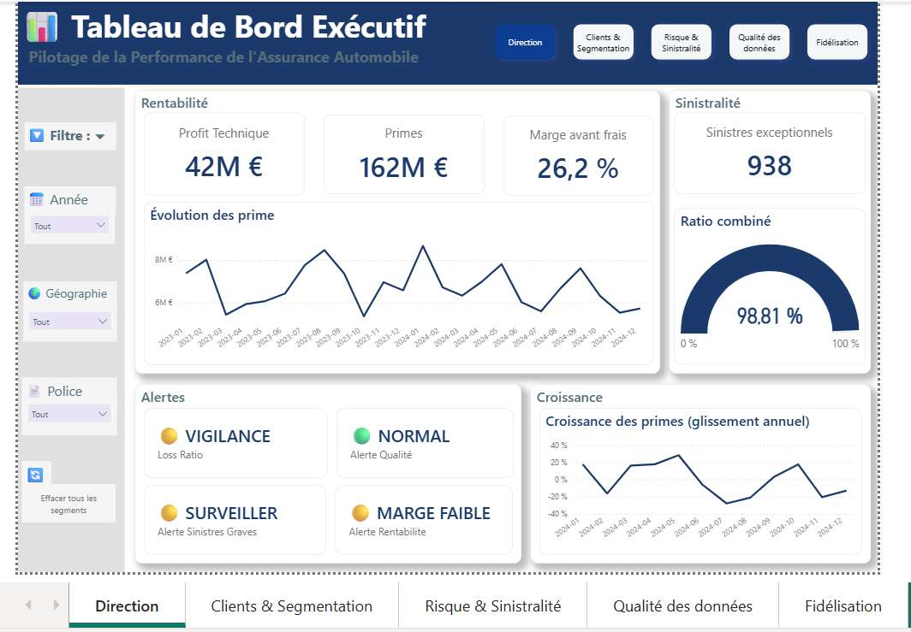
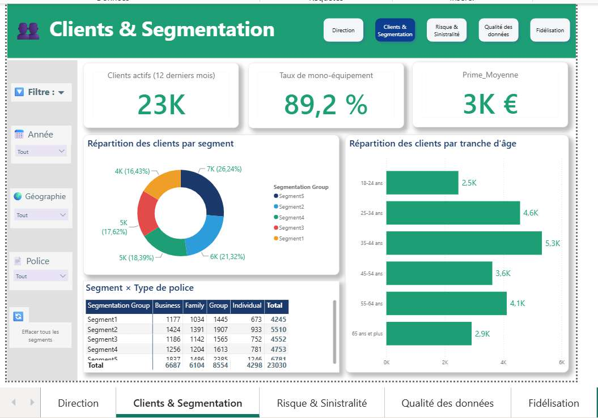
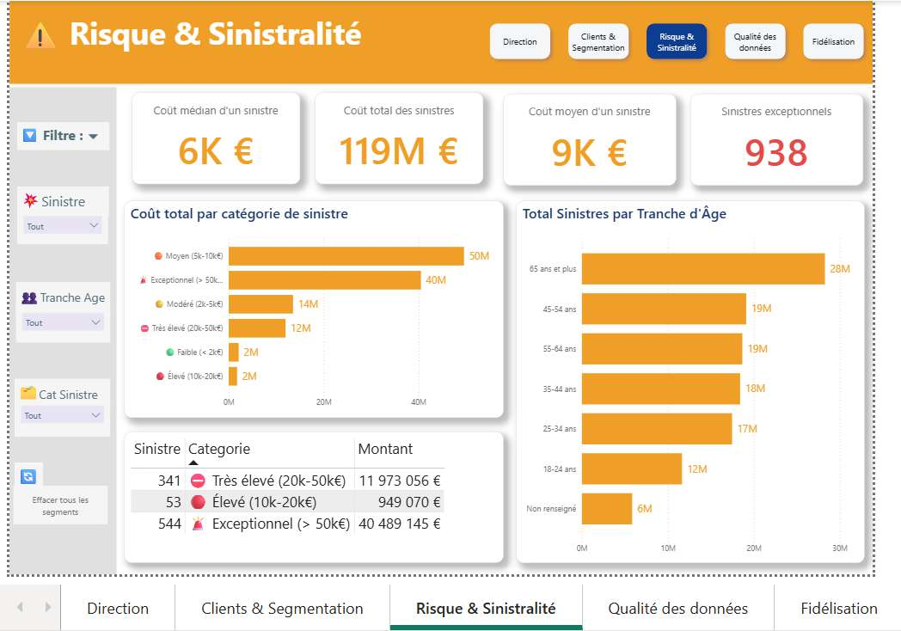

# 🚗 Dashboard BI — Assurance Automobile

**Projet Data Analytics & Business Intelligence — Formation Professionnelle**

Pilotage de la performance d'une agence d'assurance automobile via un **dashboard Power BI à 5 pages** couvrant rentabilité, segmentation clients, sinistralité, qualité des données et fidélisation.

---

## 📊 Vue d'ensemble

Ce projet analyse **116 503 lignes** réparties sur 3 jeux de données hétérogènes :
- **13 000** profils d'assurés avec montants de sinistres
- **50 000** caractéristiques et prix de véhicules vendus
- **53 503** données clients, contrats et comportements

**Objectif** : Transformer des données imparfaites en un tableau de bord décisionnel fiable permettant au directeur d'agence de piloter l'activité en temps réel.

---

## 🎯 Problématique métier centrale

> *Comment transformer trois jeux de données hétérogènes, de qualité imparfaite, en un tableau de bord décisionnel fiable permettant de piloter l'activité d'assurance en temps réel ?*

### Contexte : modèle économique de l'assurance automobile

L'assurance repose sur :
- **Collecte de primes** (revenus)
- **Versement d'indemnités** (sinistres)
- **Maîtrise des frais de gestion**

**Rentabilité technique** = Primes − Sinistres
**Combined Ratio** = (Sinistres + Frais) / Primes

- ✅ Combined Ratio < 100 % = **rentable**
- ❌ Combined Ratio > 100 % = **perte technique**

---

## 📈 KPI Principaux

| Domaine | KPI | Description | Cible |
|---------|-----|-------------|-------|
| **Rentabilité** | Profit Technique | Primes − Sinistres | > 0 € |
| | Loss Ratio | Sinistres / Primes | < 75 % |
| | Marge Technique | (Primes − Sinistres) / Primes | > 25 % |
| | Combined Ratio | Loss Ratio + Frais (25 %) | < 100 % |
| **Clients** | Clients Actifs (12m) | Base active glissante | 20K+ |
| | Taux Mono-Produit | % clients avec 1 seul produit | < 85 % |
| | Prime Moyenne | Primes / Clients | 3K € |
| **Sinistres** | Nb Sinistres Exceptionnels | Montants > IQR | < 1000 |
| | Coût Moyen | Montant moyen par sinistre | 9K € |
| | Coût Médian | Point médian distribution | 5.8K € |
| **Qualité** | Score Qualité Moyen | Complétude + Validité | 4.95 / 5 |
| | Taux Âge Valide | % âges exploitables | 95 % |
| | Taux Complétude | % lignes complètes | 95 % |

---

## 🏗️ Architecture du Dashboard (5 Pages)

### **Page 1 : Direction (Tableau Exécutif)** 🔵
**Filtre global** : Année, Géographie
**Slicers** : Police Type (synchronisé)

**Bloc A — Rentabilité**
- KPI : Profit Technique (42M €) | Primes (162M €) | Marge avant frais (26,2 %)
- Courbe : Évolution des primes (tendance annuelle)

**Bloc B — Sinistralité**
- KPI : Nb Sinistres Exceptionnels (938)
- Jauge : Combined Ratio (cible 100 %) → 98,81 %

**Bloc C — Alertes** (4 cartes avec codes couleurs DAX)
- 🟡 VIGILANCE (Loss Ratio) | 🟢 NORMAL (Qualité) | 🟠 SURVEILLER (Graves) | 🟠 MARGE FAIBLE

**Bloc D — Croissance**
- Courbe : Croissance primes année-sur-année (glissement SAMEPERIODLASTYEAR)



---

### **Page 2 : Clients & Segmentation** 🟢
**Filtre global** : Année, Géographie, Police Type
**Slicers** : Segmentation (synchronisé)

- KPI : Clients Actifs 12m (23K) | Taux mono-équipement (89,2 %) | Prime Moyenne (3K €)
- **Donut** : Segmentation (5 groupes) — répartition proportionnelle
- **Histogramme** : Clients par tranche d'âge
- **Matrice** : Segment × Type police — visualiser croisement clientèle



---

### **Page 3 : Risque & Sinistralité** 🟠
**Pas de filtre global** (Fact_Sinistres non reliée aux dimensions temporelles)
**Filtre local** : Catégorie Sinistre

- KPI : Coût médian (6K €) | Coût moyen (9K €) | Nb sinistres exceptionnels (938)
- **Histogramme** : Coût par catégorie sinistre (6 tranches) — tri décroissant
- **Table** : Détail 938 sinistres (ID, Catégorie, Montant) — tri décroissant
- **Histogramme** : Sinistres par tranche d'âge assuré
- **Tableau** : Données qualité (dates incohérentes, anomalies)



---

### **Page 4 : Qualité des Données** 🔲
**Aucun filtre** (page de contrôle global)

- KPI : Score qualité moyen (4,95/5) | Taux âge valide (95 %) | Taux complétude Sinistres (95 %) | Taux complétude Contrats (96 %)
- **Jauge** : Score qualité (cible 5/5)
- **Table** : Diagnostic prix véhicules (3 catégories : Valide 93%, Extrême Haute 5%, Aberrant 1%)
- **Table calculée** : Suivi anomalies (4 lignes avec codes couleur)
  - Dates incohérentes : 2247 (🔴 Critique)
  - Dates identiques : 23 (🟢 Normal)
  - Âges inconnus : 650 (🟡 Vigilance)
  - Prix suspects : 721 (🟡 Vigilance)
- **Histogramme** : Synthèse anomalies (même tri et couleurs)


---

### **Page 5 : Fidélisation & CRM** 🟣
**Filtre global** : Année, Géographie, Police Type
**Slicers** : Segmentation (synchronisé)

- KPI : Durée moyenne contrat (1,2K jours ≈ 3,3 ans) | Valeur client (4K € toute durée) | Produits moyens (1,23)
- **Matrice** : Segment × Tranche durée — avec barres de données
- **Donut** : Composition portefeuille par type police
- **Tables Top/Bottom** : Top 10 et Bottom 10 clients par valeur nette
  - Colonnes : Client | Primes Totales | Durée Moyenne


---

## 📁 Structure fichiers

```
assurance-automobile-dashboard/
├── README.md                           # Ce fichier
├── data/
│   ├── insurance_dataset.csv           # Profils assurés + sinistres (13K, AVEC ERREURS)
│   ├── car_sales_data.csv              # Véhicules (50K, AVEC ERREURS)
│   └── data_synthetic.csv              # Clients + contrats (53.5K, AVEC ERREURS)
├── screenshots/
│   ├── 01_Direction.jpg
│   ├── 02_Clients_Segmentation.jpg
│   ├── 03_Risque_Sinistralite.jpg
│   ├── 04_Qualite_Donnees.jpg
│   └── 05_Fidelisation_CRM.jpg
├── documentation/
│   └── Documentation_Methodologique.docx
└── assurance-automobile-dashboard.pbix
```

---

## 🔍 Audit qualité — Anomalies initiales détectées

| # | Table | Problème | Sévérité | Traitement |
|---|-------|---------|----------|-----------|
| 1 | insurance | Age = 102,42 répété 650 fois (sentinelle) | Haute | Flag + Null |
| 2 | insurance | 938 outliers Claim_Amount (max 99.8K) | Moyenne | Colonne Flag |
| 3 | insurance | Education = 3 valeurs seulement | Faible | Accepté |
| 4 | car_sales | 14 doublons parfaitement identiques | Moyenne | Supprimés |
| 5 | car_sales | Prix min = 76 € (outlier VW 422K km) | Haute | Accepté |
| 6 | synthetic | 2 formats dates mélangés | Haute | Correction M |
| 7 | synthetic | 2247 dates incohérentes (Start > Renewal) | Haute | Flag |
| 8 | synthetic | 23 dates identiques | Faible | Flag |
| 9 | Général | Emojis invisibles dans colonnes qualité | Haute | CONTAINSSTRING DAX |
| 10 | car_sales | Diagnostic prix 3 niveaux (93/5/1%) | Moyenne | Colonne |

**Score qualité initial : 4.7 / 5** ✅

---

## 📊 Modèle de Données (Star Schema)

### Dimensions
- **Dim_Assuré** : Assure_ID, Education, Gender, Occupation, Tranche_Age
- **Dim_Client** : Customer_ID, Age, Education, Gender, Occupation, Tranche_Age
- **Dim_Segmentation** : Risk Profile, Segmentation Group (5 valeurs)
- **Dim_Date** : Date, Année, Mois, Trimestre (pour évolution temporelle)

### Faits
- **Fact_Contrats** : Customer_ID, Premium Amount, Coverage, Deductible, Policy Type, dates
- **Fact_Sinistres** : Assure_ID, Claim_Amount, Catégorie_Sinistre, Fiabilité
- **Fact_Ventes** : Vehicle_ID, Price, Diagnostic_Prix_Final

⚠️ **Limite structurelle** : Fact_Sinistres non reliée à Dim_Date → pas d'évolution temporelle sinistres sur Page 3

---

## 🛠️ Stack technique

| Outil | Version | Rôle |
|-------|---------|------|
| **Power BI Desktop** | 2.138+ | Visualisation |
| **Power Query (M)** | Intégré | Nettoyage + transformation |
| **DAX** | Intégré | 45+ mesures |
| **Excel** | Source | 3 CSV avec erreurs |

---

## 📝 Mesures DAX (résumé)

```dax
# Rentabilité
Primes_Totales = SUM(Fact_Contrats[Premium Amount])
Sinistres_Totaux = SUM(Fact_Sinistres[Claim_Amount])
Profit_Technique = [Primes_Totales] - [Sinistres_Totaux]
Loss_Ratio = DIVIDE([Sinistres_Totaux], [Primes_Totales], 0)
Combined_Ratio = [Loss_Ratio] + 0.25
Marge_Technique = DIVIDE([Profit_Technique], [Primes_Totales], 0)

# Clients
Clients_Actifs = CALCULATE(DISTINCTCOUNT(Customer_ID),
  Policy_Start <= MAX(Date) AND Policy_Renewal >= MAX(Date)-365)
Taux_Mono_Produit = DIVIDE(
  CALCULATE(DISTINCTCOUNT(Customer_ID), DISTINCTCOUNT(Policy_Type)=1),
  [Clients_Actifs], 0)
Prime_Moyenne_Client = DIVIDE([Primes_Totales], [Clients_Actifs], 0)

# Qualité
Score_Qualite_Moyen = AVERAGE(Fact_Sinistres[Score_Qualite])
Taux_Age_Valide = CALCULATE(COUNTROWS(...), CONTAINSSTRING(Fiabilite_Age, "Valide")) / COUNTROWS(...)
Nb_Dates_Incoherentes = CALCULATE(COUNTROWS(...), CONTAINSSTRING(Statut_Coherence_Dates, "Start après"))

# Alertes (retournent code couleur)
Alerte_Loss_Ratio = IF([Loss_Ratio] > 0.75, "🟡 VIGILANCE", IF([Loss_Ratio] > 0.85, "🔴 CRITIQUE", "🟢 OK"))
```

---

## 🚀 Phases de réalisation

- ✅ **Phase 1** : Compréhension du besoin métier
- ✅ **Phase 2** : Audit et exploration données
- ⏳ **Phase 3** : Conception architecture Excel (N/A)
- ⏳ **Phase 4** : Power Query + nettoyage
- ⏳ **Phase 5** : Modélisation Star Schema
- ⏳ **Phase 6** : Mesures DAX
- ⏳ **Phase 7** : Construction 5 pages
- ⏳ **Phase 8** : Storytelling + insights
- ⏳ **Phase 9** : Portfolio + présentation

---

## 📚 Ressources

- **Documentation complète** : `documentation/Documentation_Methodologique.docx`
- **Données sources** : `data/*.csv`
- **Captures d'écran** : `screenshots/*.jpg`

---

**Version 2.0** | Mise à jour : Août 2026 | Status : Construction en cours
