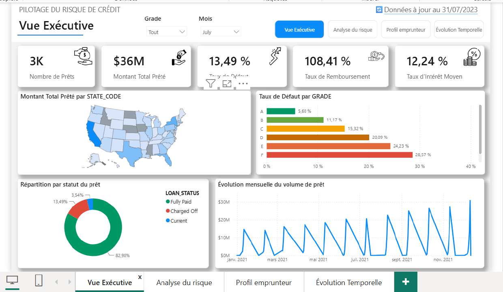
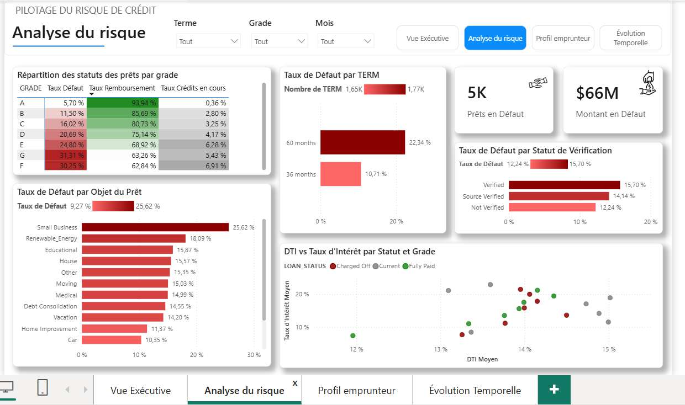
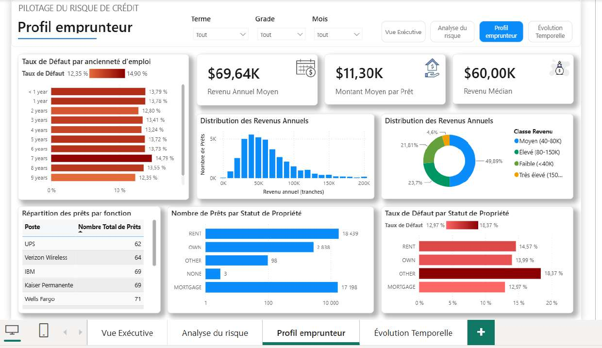
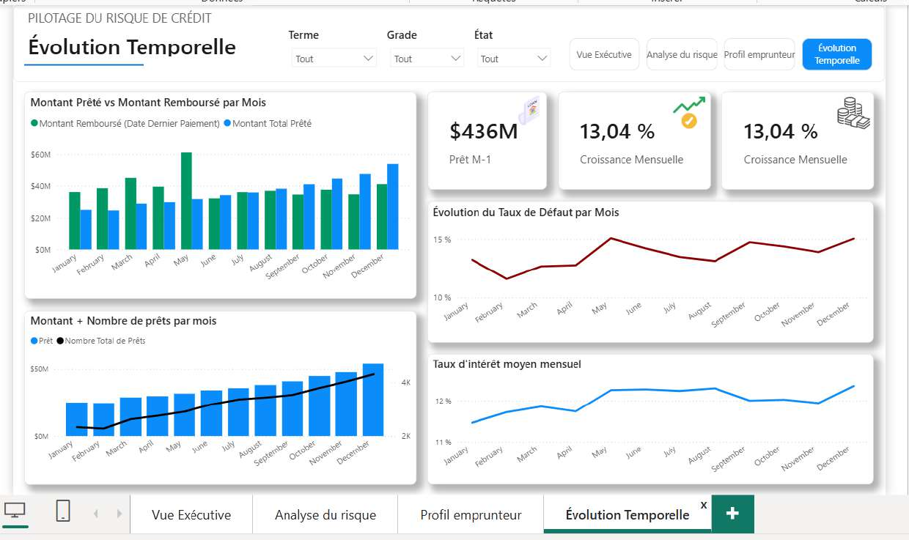

# 💳 Pilotage du Risque de Crédit | Analyse de Prêts Bancaires

## 🎯 Objectif

Construire un dashboard Power BI de **pilotage du risque de crédit** permettant à une institution financière de suivre la santé de son portefeuille de prêts : volume prêté, taux de défaut, rentabilité, et profil de risque par grade, objet du prêt, statut de vérification et profil emprunteur.

## 🧩 Contexte

Le dataset couvre **38 576 contrats de prêt**, répartis dans les **50 États américains**. Les prêts ont été émis en **2021**, du 1er janvier au 12 décembre 2021, avec un suivi de paiement s'étendant jusqu'en janvier 2022.

La table calendrier couvre volontairement une période plus large, d'octobre 2021 à janvier 2024, afin d'anticiper l'intégration de nouvelles données sans reconstruire le modèle.

## 🔗 Sources de données

* `LOANS_FACT` — table de faits principale des contrats de prêt
* Dimensions : État, Grade, Statut de vérification, Statut de propriété, Ancienneté d'emploi, Métier
* `Date_Dimension_tab` — table calendrier dédiée

## 📈 KPIs

| KPI                        | Description                                       |
| -------------------------- | ------------------------------------------------- |
| Montant Total Prêté        | Volume total du portefeuille                      |
| Nombre Total de Prêts      | Nombre de contrats                                |
| Montant Moyen par Prêt     | Taille moyenne d'un contrat                       |
| Taux de Défaut             | % de prêts en défaut — **13,82 %**                |
| Taux de Remboursement      | Montant remboursé / montant prêté                 |
| Taux d'Intérêt Moyen       | Taux d'intérêt moyen du portefeuille              |
| DTI Moyen                  | Ratio dette/revenu moyen                          |
| Revenu Annuel Moyen        | Profil de revenu des emprunteurs                  |
| Montant en Défaut          | Exposition sur les prêts en défaut                |
| Croissance Mensuelle       | Évolution du montant prêté vs mois précédent      |
| Montant Prêté Cumul Annuel | Cumul du montant prêté depuis le début de l'année |

## 🧱 Modélisation

Le modèle repose sur un **schéma en étoile**, avec `LOANS_FACT` comme table de faits centrale, reliée à une table calendrier et aux différentes dimensions de risque.

### DAX — Taux d'intérêt

La colonne `INT_RATE` étant déjà multipliée par 100 lors de la préparation Power Query, la mesure divise explicitement la valeur par 100 avant l'application du format Pourcentage natif de Power BI.

Cette correction évite notamment l'affichage erroné de valeurs comme **1204,88 % au lieu de 12,05 %**.

### DAX — Croissance mensuelle

La croissance est calculée sur des **mois complets** afin d'éviter les comparaisons jour-à-jour non représentatives.

Le dernier mois disposant de données est identifié dynamiquement puis comparé au mois précédent via `EDATE`.

Résultat validé : **+13,04 % en décembre 2021 vs novembre 2021**.

## 🔍 Analyses réalisées

### Analyse du risque

* Matrice **Grade × Statut de prêt**
* Taux de défaut par grade
* Taux de remboursement
* Crédits en cours
* Analyse par objet du prêt
* Analyse par statut de vérification
* Relation entre DTI et taux d'intérêt

Les grades **F et G** présentent les niveaux de défaut les plus élevés, avec environ **24 à 31 %**, contre environ **5 à 6 % pour le grade A**.

### Profil emprunteur

* Statut de propriété
* Ancienneté d'emploi
* Distribution des revenus
* Revenu annuel moyen et médian
* Top 10 des métiers

### Évolution temporelle

L'analyse temporelle porte principalement sur **2021**, seule année complète disponible dans les données.

Le volume mensuel de prêts augmente fortement sur l'année, tandis que le taux de défaut reste relativement stable dans une fourchette d'environ **11,6 % à 15,1 %**.

## 🖼️ Dashboard

Le rapport comprend **4 pages**, chacune répondant à une question métier spécifique.

### 1. Vue Exécutive

Vue destinée à permettre à un dirigeant d'évaluer rapidement l'état du portefeuille.

* KPI principaux
* Répartition des statuts de prêt
* Taux de défaut par grade
* Montant prêté par État
* Évolution mensuelle du volume



### 2. Analyse du Risque

Identification des zones de risque et des facteurs associés.

* Matrice Grade × Statut
* Taux de défaut par objet du prêt
* Taux de défaut par statut de vérification
* DTI vs taux d'intérêt



### 3. Profil Emprunteur

Analyse de la population emprunteuse pour accompagner la politique d'octroi.

* Revenus moyens et médians
* Distribution des revenus
* Défauts par statut de propriété
* Défauts par ancienneté d'emploi
* Top 10 des métiers



### 4. Évolution Temporelle

Analyse de la dynamique du portefeuille sur 2021.

* Montant prêté vs montant remboursé
* Croissance mensuelle
* Évolution du taux de défaut
* Évolution du taux d'intérêt moyen



> **Note méthodologique :** les captures peuvent afficher des éléments hérités d'un gabarit initial. La période réellement couverte par les données est **2021**.

## 💡 Insights clés

* Le taux de défaut global est de **13,82 %**, avec une forte différenciation selon le grade.
* Le grade constitue le facteur de risque le plus discriminant observé dans l'analyse.
* Le volume mensuel de prêts a progressé d'environ **115,7 % entre janvier et décembre 2021**.
* Cette croissance ne s'est pas accompagnée d'une dégradation continue du taux de défaut.
* Le taux de défaut varie entre environ **11,6 % et 15,1 %** selon les mois.
* La comparaison de **mois complets** est indispensable pour obtenir une croissance mensuelle fiable lorsque l'activité quotidienne est irrégulière.

## 🛠️ Technologies

* **Power BI Desktop**
* **Power Query (M)**
* **DAX**
* Modélisation dimensionnelle / **Star Schema**
* Data Visualization
* Analyse du risque de crédit

## 📂 Structure du projet

```text
pilotage-risque-credit-bancaire/
├── README.md
├── data/
│   └── # Données sources
├── screenshots/
│   ├── 01-vue-executive.jpg
│   ├── 02-analyse-du-risque.jpg
│   ├── 03-profil-emprunteur.jpg
│   └── 04-evolution-temporelle.jpg
├── documentation/
│   └── Corrections_Projet_BI.docx
└── pilotage-risque-credit-bancaire.pbix
```

## ⚠️ Limites

* Les données de production couvrent principalement **l'année 2021**.
* Les analyses YoY sont donc limitées par l'absence d'une année précédente comparable.
* La table calendrier couvre une période plus large que les données actuellement disponibles.
* Les indicateurs de risque décrivent le portefeuille observé et ne constituent pas, à eux seuls, un modèle prédictif de défaut.

## 🎓 Compétences démontrées

| Compétence                | Application                                                        |
| ------------------------- | ------------------------------------------------------------------ |
| **Data Modeling**         | Construction d'un schéma en étoile                                 |
| **DAX**                   | KPIs, calculs temporels, variables, `CALCULATE`, `FILTER`, `EDATE` |
| **Power Query**           | Préparation et transformation des données                          |
| **Risk Analytics**        | Analyse du défaut par grade et profil                              |
| **Time Intelligence**     | Croissance mensuelle et cumul annuel                               |
| **Data Visualization**    | Dashboard exécutif et analyses interactives                        |
| **Business Intelligence** | Transformation des données en indicateurs décisionnels             |
| **Data Quality**          | Vérification et correction des incohérences de calcul              |

---

**Projet Power BI — Pilotage du Risque de Crédit | 2026**
